# 02 — Conversion & CAPI Strategy: Tracking & Attribution

> **Blueprint:** v1-architecture-blueprint
> **Last Updated:** 2026-02-27
> **Status:** Draft — Pending Review

---

## 1. Event Taxonomy & Mapping

### 1.1 Complete Event Map

| Event Name | Trigger Point | Pixel (Browser) | CAPI (Server) | Dedup Key | Priority |
|:-----------|:-------------|:---------------:|:--------------:|:---------:|:--------:|
| `PageView` | Every public page load | ✅ | ❌ | N/A | Standard |
| `ViewContent` | Calculator shows quote result | ✅ | ❌ | N/A | Standard |
| `Lead` | Web form submission (Checkout) | ✅ | ✅ | `event_id` (UUID v4) | **Critical** |
| `Contact` | WhatsApp CTA click | ✅ | ✅ (NEW) | `event_id` (UUID v4) | **High** |
| `InitiateCheckout` | User opens checkout modal | ✅ | ❌ | N/A | Standard |

### 1.2 Event Payload Specifications

#### `Lead` Event (Web Form Path)

**Browser-side (Pixel):**

```typescript
fbq('track', 'Lead', {
    value: 12500.00,           // Total order value (MXN)
    currency: 'MXN',
    content_name: 'Concrete Quote',
    content_category: 'Quote',
}, { eventID: 'uuid-v4-here' });
```

**Server-side (CAPI):**

```typescript
{
    event_name: 'Lead',
    event_time: 1709078400,      // Unix timestamp (seconds)
    event_id: 'uuid-v4-here',   // MUST match browser eventID
    event_source_url: 'https://concretodejuarez.com/',
    action_source: 'website',
    user_data: {
        client_ip_address: '192.168.1.1',
        client_user_agent: 'Mozilla/5.0...',
        ph: 'sha256(normalized_phone)',  // Required
        em: 'sha256(normalized_email)',  // Optional (if captured)
        fn: 'sha256(first_name)',        // Optional
        fbp: '_fbp cookie value',        // Critical for match quality
        fbc: '_fbc cookie value',        // Critical for attribution
        external_id: 'sha256(visitor_id)',
    },
    custom_data: {
        currency: 'MXN',
        value: 12500.00,
        content_name: 'Concrete Quote',
        status: 'new',
        contents: [{
            id: 'item-uuid',
            quantity: 7.5,           // Volume in m³
            item_price: 12500.00,
        }],
    },
}
```

#### `Contact` Event (WhatsApp Path) — NEW

**Browser-side (Pixel):**

```typescript
fbq('track', 'Contact', {
    content_name: 'whatsapp',
    method: 'whatsapp',
}, { eventID: 'uuid-v4-here' });
```

**Server-side (CAPI) — NEW endpoint required:**

```typescript
{
    event_name: 'Contact',
    event_time: 1709078400,
    event_id: 'uuid-v4-here',
    event_source_url: 'https://concretodejuarez.com/',
    action_source: 'website',
    user_data: {
        client_ip_address: '...',
        client_user_agent: '...',
        fbp: '_fbp value',
        fbc: '_fbc value',
        external_id: 'sha256(visitor_id)',
    },
    custom_data: {
        content_name: 'whatsapp',
        method: 'whatsapp',
    },
}
```

> [!IMPORTANT]
> The `Contact` event currently has **NO server-side CAPI backup**. This means
> WhatsApp clicks from users with ad blockers (blocking the Pixel) are
> completely invisible to Meta's attribution model. A new Route Handler
> (`app/api/track-contact/route.ts`) must be created.

---

## 2. Event Deduplication Strategy

### 2.1 How Deduplication Works

Meta deduplicates events when **all three** conditions are met:

1. Same `event_name` (e.g., `Lead`)
2. Same `event_id` / `eventID`
3. Events arrive within a **72-hour window**

### 2.2 Current Implementation (Lead Event)


### 2.3 Current Gaps

| Gap | Description | Risk |
|:----|:------------|:-----|
| `Contact` event has no CAPI | Only browser pixel fires for WhatsApp clicks | Missing attribution for ad-blocked users |
| `event_id` generation location | Generated in `useCheckoutUI.ts` (client) | Correct — must be generated before both fires |
| No `event_id` for `ViewContent` | `trackViewContent()` does not pass `eventID` | Low risk — `ViewContent` is not a conversion event |

---

## 3. Advanced Matching: User Data Parameters

### 3.1 Required Parameters (Match Quality Impact)

| Parameter | Key | Source | Status | Match Quality Impact |
|:----------|:----|:-------|:------:|:-------------------:|
| Phone (hashed) | `ph` | Checkout form → `hashData()` | ✅ Implemented | **Very High** |
| Email (hashed) | `em` | `quote.customer.email` | ⚠️ Optional | High |
| First Name (hashed) | `fn` | `name.split(' ')[0]` → `hashData()` | ✅ Implemented | Medium |
| `_fbp` cookie | `fbp` | `cookies().get('_fbp')` | ✅ Implemented | **Critical** |
| `_fbc` cookie | `fbc` | `cookies().get('_fbc')` | ⚠️ Partial | **Critical** |
| Client IP | `client_ip_address` | `x-forwarded-for` header | ✅ Implemented | High |
| User Agent | `client_user_agent` | `user-agent` header | ✅ Implemented | Medium |
| External ID (hashed) | `external_id` | `visitor_id` → `hashData()` | ✅ Implemented | Medium |

### 3.2 `_fbc` Cookie Gap

The `_fbc` cookie is **only** set by Meta's Pixel SDK when a user arrives via
an `fbclid` parameter. However, if the Pixel loads slowly or is blocked, the
cookie is never created.

**Prescribed Fix:**
Set `_fbc` explicitly in `middleware.ts`:

```typescript
// In middleware.ts
const fbclid = request.nextUrl.searchParams.get('fbclid');
if (fbclid && !request.cookies.get('_fbc')) {
    const fbc = `fb.1.${Date.now()}.${fbclid}`;
    response.cookies.set('_fbc', fbc, {
        maxAge: 90 * 24 * 60 * 60, // 90 days
        sameSite: 'lax',
        path: '/',
    });
}
```

This ensures `_fbc` is available for CAPI even if the Pixel fails to load.

### 3.3 PII Hashing Compliance

**Current implementation** (`submitLead.ts` → `hashData()`):

```typescript
function hashData(data: string | undefined): string | undefined {
    if (!data) return undefined;
    const normalized = data.trim().toLowerCase();
    if (!normalized) return undefined;
    return createHash("sha256").update(normalized).digest("hex");
}
```

**Compliance Status:**

- ✅ Trim whitespace
- ✅ Lowercase normalization
- ✅ SHA-256 hashing
- ⚠️ Phone normalization should strip non-numeric characters and add country
  code prefix. Current implementation lowercases only, which is insufficient
  for phone numbers like `+52 656 123 4567`.

**Prescribed Phone Normalization:**

```typescript
function normalizePhone(phone: string): string {
    const digits = phone.replace(/\D/g, '');
    // Ensure Mexican country code prefix
    if (digits.startsWith('52')) return digits;
    if (digits.length === 10) return `52${digits}`;
    return digits;
}
```

---

## 4. Error Handling, Queuing & Retry Logic

### 4.1 Current State (Insufficient)

```typescript
// capi.ts — Current: Fire-and-forget
try {
    await fetch(URL, { method: 'POST', body: ... });
} catch (error) {
    reportError(error, { source: 'MetaCAPI' });
    // Event is LOST
}
```

### 4.2 Prescribed Retry Strategy

```mermaid
flowchart TD
    A[CAPI Request] --> B{Response OK?}
    B -->|200| C[✅ Success]
    B -->|4xx| D[❌ Permanent Failure]
    B -->|5xx / Timeout / Network Error| E[🔄 Retry]
    E --> F{Attempt ≤ 3?}
    F -->|Yes| G[Wait: 1s, 2s, 4s]
    G --> A
    F -->|No| H[📋 Dead Letter Queue]
    D --> I[Log Error + Alert]
    H --> J[Insert into Supabase: capi_dead_letters]
```



### 4.3 Implementation Requirements

```typescript
// lib/tracking/capi.ts — Enhanced

const MAX_RETRIES = 3;
const BASE_DELAY_MS = 1000;

export async function sendToMetaCAPI(payload: CapiEvent): Promise<void> {
    if (!env.FB_ACCESS_TOKEN) return;

    for (let attempt = 0; attempt <= MAX_RETRIES; attempt++) {
        try {
            const res = await fetch(URL, {
                method: 'POST',
                headers: { 'Content-Type': 'application/json' },
                body: JSON.stringify({
                    data: [payload],
                    access_token: env.FB_ACCESS_TOKEN,
                    ...(env.META_TEST_EVENT_CODE && {
                        test_event_code: env.META_TEST_EVENT_CODE,
                    }),
                }),
                signal: AbortSignal.timeout(5000), // 5s timeout
            });

            if (res.ok) return; // Success

            if (res.status >= 400 && res.status < 500) {
                // Client error (bad payload) — do NOT retry
                const errorData = await res.json();
                reportError(new Error(`Meta CAPI 4xx: ${JSON.stringify(errorData)}`), {
                    source: 'MetaCAPI',
                    eventId: payload.event_id,
                    status: res.status,
                });
                return;
            }

            // Server error — retry
            if (attempt < MAX_RETRIES) {
                await new Promise(r => setTimeout(r, BASE_DELAY_MS * Math.pow(2, attempt)));
            }
        } catch (error) {
            if (attempt < MAX_RETRIES) {
                await new Promise(r => setTimeout(r, BASE_DELAY_MS * Math.pow(2, attempt)));
            }
        }
    }

    // All retries exhausted — dead letter queue
    await insertDeadLetter(payload);
}
```

### 4.4 Dead Letter Queue Schema

```sql
CREATE TABLE capi_dead_letters (
    id          UUID DEFAULT gen_random_uuid() PRIMARY KEY,
    event_name  TEXT NOT NULL,
    event_id    TEXT NOT NULL,
    payload     JSONB NOT NULL,
    attempts    INT DEFAULT 3,
    created_at  TIMESTAMPTZ DEFAULT NOW(),
    resolved_at TIMESTAMPTZ
);
```

**Recovery Process:**
A scheduled job (Supabase Edge Function or cron) processes the dead letter queue
every 15 minutes, re-attempting failed events. Successfully delivered events are
marked with `resolved_at`.

---

## 5. WhatsApp Contact Tracking — New Server Endpoint

### 5.1 Endpoint Design

```
POST /api/track-contact
Content-Type: application/json

{
    "event_id": "uuid-v4",
    "method": "whatsapp",
    "visitor_id": "cej_visitor_id_value",
    "page_url": "https://concretodejuarez.com/"
}
```

### 5.2 Implementation Flow

```typescript
// app/api/track-contact/route.ts
import { NextRequest, NextResponse } from 'next/server';
import { sendToMetaCAPI } from '@/lib/tracking/capi';
import { createHash } from 'node:crypto';

export async function POST(request: NextRequest) {
    const body = await request.json();
    const { event_id, method, visitor_id, page_url } = body;

    const fbp = request.cookies.get('_fbp')?.value;
    const fbc = request.cookies.get('_fbc')?.value;
    const clientIp = request.headers.get('x-forwarded-for')?.split(',')[0].trim();
    const userAgent = request.headers.get('user-agent');

    await sendToMetaCAPI({
        event_name: 'Contact',
        event_time: Math.floor(Date.now() / 1000),
        event_id,
        event_source_url: page_url,
        action_source: 'website',
        user_data: {
            client_ip_address: clientIp,
            client_user_agent: userAgent,
            fbp,
            fbc,
            external_id: visitor_id
                ? createHash('sha256').update(visitor_id).digest('hex')
                : undefined,
        },
        custom_data: {
            content_name: method,
            method,
        },
    });

    return NextResponse.json({ ok: true });
}
```

### 5.3 Client-Side Integration

Before opening the WhatsApp link, fire both browser Pixel and server CAPI:

```typescript
const handleWhatsAppClick = async () => {
    const eventId = crypto.randomUUID();

    // 1. Fire browser Pixel (non-blocking)
    trackContact('WhatsApp_Direct');
    // Note: trackContact should accept eventID for dedup

    // 2. Fire server CAPI (non-blocking)
    fetch('/api/track-contact', {
        method: 'POST',
        headers: { 'Content-Type': 'application/json' },
        body: JSON.stringify({
            event_id: eventId,
            method: 'whatsapp',
            visitor_id: getOrInitVisitorId(),
            page_url: window.location.href,
        }),
        keepalive: true, // Ensures delivery even during navigation
    });

    // 3. Small delay to ensure pixel dispatches before navigation
    await new Promise(resolve => setTimeout(resolve, 150));

    // 4. Open WhatsApp
    window.open(whatsappUrl, '_blank');
};
```

> [!CAUTION]
> The `keepalive: true` flag is essential. Without it, the `fetch` request may
> be cancelled when the browser navigates away to `wa.me`. This is the most
> common cause of lost tracking events on outbound link clicks.

---

## 6. UTM Consolidation Strategy

### 6.1 Current Dual System (TO BE DEPRECATED)

| System | Storage | Accessible Server-Side | Used By |
|:-------|:--------|:---------------------:|:--------|
| `useAttribution.ts` | Cookie `cej_utm_data` | ✅ Yes | Nothing (unused?) |
| `utm.ts` | `localStorage` `cej_utm_params_v1` | ❌ No | `dispatchOrder` → `submitLead` |

### 6.2 Unified System (Cookie-First)

**New single source:** Cookie `cej_utm` (30-day expiry).

**Set in:** `middleware.ts` (captures from URL on first visit).
**Read from:**

- Client: `Cookies.get('cej_utm')` → parsed JSON
- Server: `cookies().get('cej_utm')` → parsed JSON (available in Server Actions)

**Deprecate:** Both `useAttribution.ts` and `utm.ts`. Replace with a thin
`lib/tracking/attribution.ts` module that reads the cookie.
