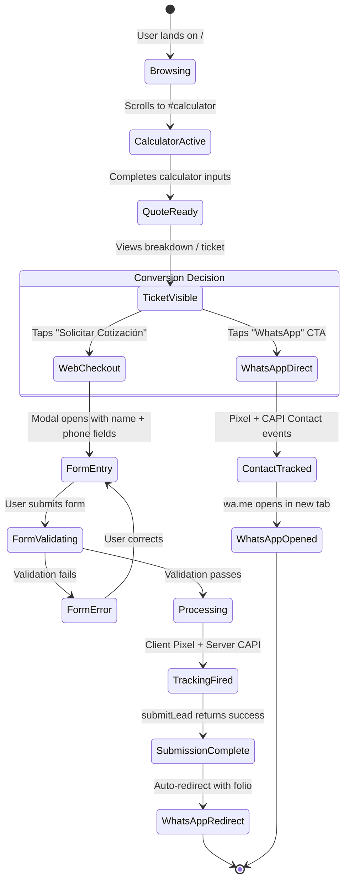

# 03 — UX Friction Reduction: Conversion Flow Optimization

> **Blueprint:** v1-conversion-redesign
> **Last Updated:** 2026-02-27
> **Status:** Draft — Pending Review

---

## 1. Hybrid Order / WhatsApp Flow — UX State Machine

### 1.1 State Diagram



### 1.2 Key State Rules

| State | User Can Go Back? | Loading Indicator? | Exit Conditions |
|:------|:------------------:|:-------------------:|:---------------|
| CalculatorActive | ✅ (scroll) | ❌ | Complete all required fields |
| QuoteReady | ✅ (edit inputs) | ❌ | View ticket or CTA |
| FormEntry | ✅ (close modal) | ❌ | Submit or dismiss |
| FormValidating | ❌ (locked) | ✅ Button spinner | Success or error |
| Processing | ❌ (locked) | ✅ Full overlay | Server response |
| WhatsAppRedirect | ❌ | ❌ (instant) | Navigation away |

---

## 2. Form Validation Strategy

### 2.1 Philosophy: Strict but Graceful

Validation must prevent bad data from reaching the server without creating
friction that causes user drop-off. The strategy is **optimistic inline
validation** — errors appear *after* the user leaves a field, not while typing.

### 2.2 Field Specifications

| Field | Required | Validation Rule | Error Message | Trigger |
|:------|:--------:|:---------------|:-------------|:--------|
| `name` | ✅ | Min 2 chars, max 80 chars, no numbers | "Ingresa tu nombre completo" | `onBlur` |
| `phone` | ✅ | Exactly 10 digits (Mexican mobile) | "Ingresa un número de 10 dígitos" | `onBlur` |
| Privacy checkbox | ✅ | Must be checked | "Acepta el aviso de privacidad" | `onSubmit` |

### 2.3 UX Patterns for Validation

```
╔══════════════════════════════════════╗
║  Solicitar Cotización                ║
╠══════════════════════════════════════╣
║                                      ║
║  Nombre completo                     ║
║  ┌──────────────────────────────┐   ║
║  │ Juan Pérez                    │   ║
║  └──────────────────────────────┘   ║
║                                      ║
║  Teléfono (10 dígitos)              ║
║  ┌──────────────────────────────┐   ║
║  │ 656 123 4567                  │   ║
║  └──────────────────────────────┘   ║
║  ⚠️ Ingresa un número de 10 dígitos ║  ← Error appears on blur
║                                      ║
║  ☑ Acepto el aviso de privacidad    ║
║                                      ║
║  ┌──────────────────────────────┐   ║
║  │    Enviar Cotización          │   ║  ← Disabled until all valid
║  └──────────────────────────────┘   ║
║                                      ║
╚══════════════════════════════════════╝
```

**Error States:**
- **Visual:** Red border (`$color-error`) + error icon + inline message below field
- **Accessible:** `aria-invalid="true"` + `aria-describedby` linking to error message
- **Recovery:** Error clears on next valid `onBlur` event (not on keystroke)

### 2.4 Phone Input Enhancement

```
Input: "6 5 6 - 1 2 3   4567"
Normalized: "6561234567"
Display: "656 123 4567" (auto-formatted with spaces)
```

The phone input should:
1. Accept only numeric characters (strip non-digits on input)
2. Auto-format with spaces: `### ### ####`
3. Show digit counter: `7/10` (disappears at 10 digits complete)
4. Submit the raw 10-digit string to the server

---

## 3. Pre-Navigation Tracking (Critical Path)

### 3.1 Problem

When a user clicks a WhatsApp CTA, the browser immediately navigates to `wa.me`.
If the tracking event (`fbq('track', 'Contact')`) hasn't finished dispatching,
it is **silently cancelled** by the browser.

### 3.2 Solution: Fire-Before-Navigate Pattern

```typescript
// Prescribed pattern for all outbound navigation with tracking
async function handleTrackedOutboundClick(
    trackingFn: () => void | Promise<void>,
    capiPayload: Record<string, unknown>,
    destinationUrl: string,
) {
    // Step 1: Fire browser pixel (synchronous dispatch to queue)
    trackingFn();

    // Step 2: Fire server CAPI (with keepalive for navigation safety)
    fetch('/api/track-contact', {
        method: 'POST',
        headers: { 'Content-Type': 'application/json' },
        body: JSON.stringify(capiPayload),
        keepalive: true, // Survives page navigation
    });

    // Step 3: Micro-delay to ensure pixel network request is dispatched
    // 150ms is sufficient for the browser to flush the beacon queue
    await new Promise(resolve => setTimeout(resolve, 150));

    // Step 4: Navigate
    window.open(destinationUrl, '_blank');
}
```

> [!WARNING]
> The `keepalive: true` option limits the request body to 64KB (per spec).
> This is well within our CAPI payload size but must be noted as a constraint.

### 3.3 Timing Table

| Action | Duration | Blocking? |
|:-------|:---------|:----------|
| `fbq('track', ...)` | ~1ms (queues to Pixel SDK) | No |
| `fetch('/api/track-contact', {keepalive})` | ~5ms (dispatches) | No |
| `setTimeout(150ms)` | 150ms | **Yes** |
| `window.open(wa.me)` | ~0ms | No |
| **Total perceived delay:** | **~155ms** | Imperceptible |

---

## 4. Mobile Responsiveness & Touch Target Optimization

### 4.1 CTA Button Specifications

| Property | Desktop | Mobile (< 768px) |
|:---------|:--------|:-----------------|
| Min height | 48px | **56px** (Apple HIG recommendation) |
| Min width | 200px | 100% of container |
| Font size | 16px | 18px |
| Touch padding | 8px | 12px (ensures 48x48px minimum touch target) |
| Spacing between CTAs | 16px | 12px |

### 4.2 Sticky CTA Pattern (SmartBottomBar)

The `SmartBottomBar` component should:

1. **Appear** when the hero section scrolls out of viewport
2. **Disappear** when the calculator section is in viewport (user is interacting)
3. **Re-appear** after calculator interaction completes (ticket visible)
4. **Not overlap** with the checkout modal
5. **Be dismissible** (subtle collapse gesture / close icon)

### 4.3 Critical Interaction Zone (Thumb Zone)

```
┌──────────────────────┐
│                      │
│    Content Area      │  ← Scrollable
│                      │
│                      │
├──────────────────────┤  ← Thumb comfort zone starts
│  ┌────────────────┐  │
│  │  💬 WhatsApp   │  │  ← Primary CTA (left thumb reach)
│  └────────────────┘  │
│  ┌────────────────┐  │
│  │  📋 Cotizar    │  │  ← Secondary CTA
│  └────────────────┘  │
├──────────────────────┤  ← Safe area bottom
│     ●  ▬  ◼         │  ← Navigation bar (iOS/Android)
└──────────────────────┘
```

**Rule:** Primary CTA (WhatsApp) must be placed in the **left-center** zone of
the bottom bar for optimal right-handed thumb reach.

### 4.4 Viewport-Specific Optimizations

| Breakpoint | Optimization |
|:-----------|:-------------|
| < 375px | Stack CTAs vertically, full-width, 56px height |
| 375-768px | Stack CTAs vertically, 90% width, centered |
| 768-1024px | Side-by-side CTAs, 50% width each |
| > 1024px | Inline CTAs within content flow, fixed max-width |

### 4.5 Input Responsiveness

On mobile devices, form inputs must:

1. Use `inputMode="tel"` for phone (shows numeric keyboard, not text)
2. Use `inputMode="text"` with `autocomplete="name"` for name
3. Set `font-size: 16px` minimum (prevents iOS auto-zoom on focus)
4. Have `interactiveWidget: 'resizes-content'` in viewport config (already set
   in `(app)/layout.tsx`, must be applied to `(public)/layout.tsx` too)

---

## 5. Error Recovery UX

### 5.1 Server Submission Failures

If `submitLead` returns an error or the network request fails:

```
State: FormEntry → Processing → ERROR

Display:
┌──────────────────────────────────┐
│  ⚠️ No pudimos enviar tu         │
│  cotización. Tu folio temporal:  │
│                                  │
│  📋  OFFLINE-K7F2X              │  ← Tap to copy
│                                  │
│  Puedes compartirlo por WhatsApp │
│  directamente:                   │
│                                  │
│  ┌────────────────────────────┐  │
│  │  💬 Enviar por WhatsApp    │  │  ← Fallback CTA
│  └────────────────────────────┘  │
│                                  │
│  ┌────────────────────────────┐  │
│  │  🔄 Intentar de nuevo     │  │  ← Retry
│  └────────────────────────────┘  │
└──────────────────────────────────┘
```

**Key Principle:** The user must NEVER be left without a path forward. Even in
complete failure, provide:
1. A temporary folio for reference
2. A WhatsApp fallback link with the folio pre-filled in the message
3. A retry option

### 5.2 Empty/Incomplete Quote Recovery

If the user navigates to checkout with an empty or invalid cart:

- **Redirect** back to `/#calculator` with a toast notification
- **Preserve** any partially entered form data in sessionStorage
- **Log** the event for analytics (indicates UX confusion)
