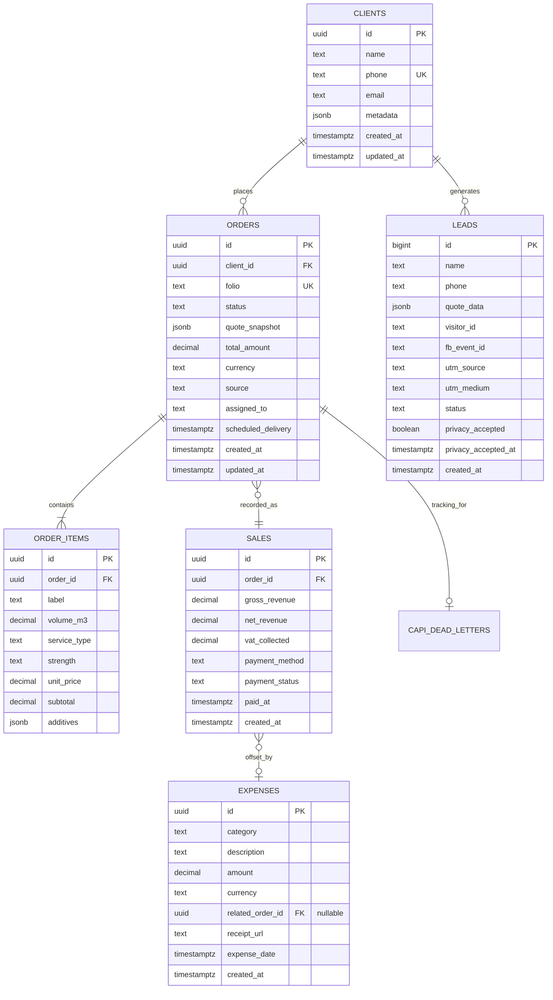
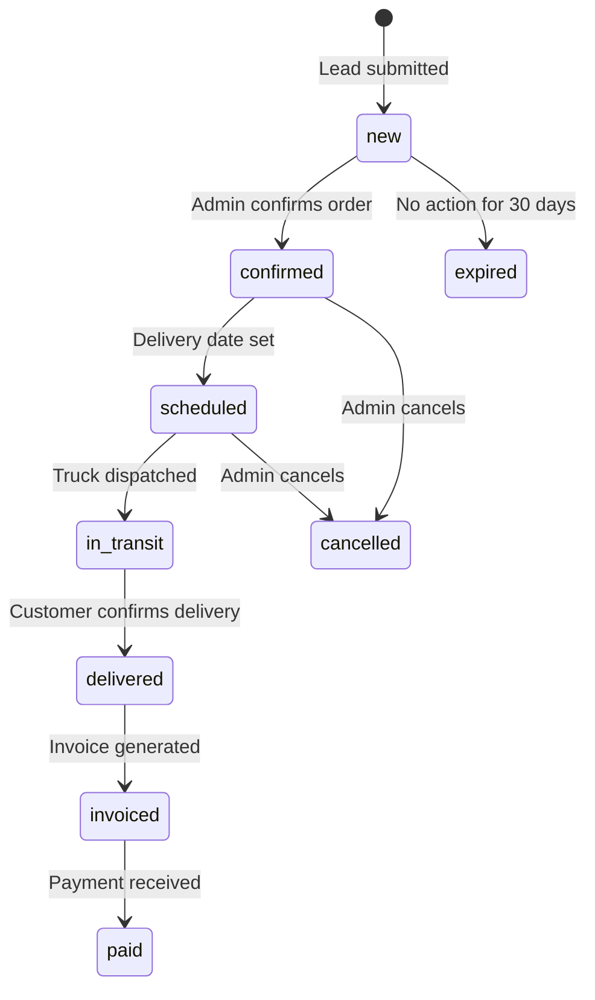
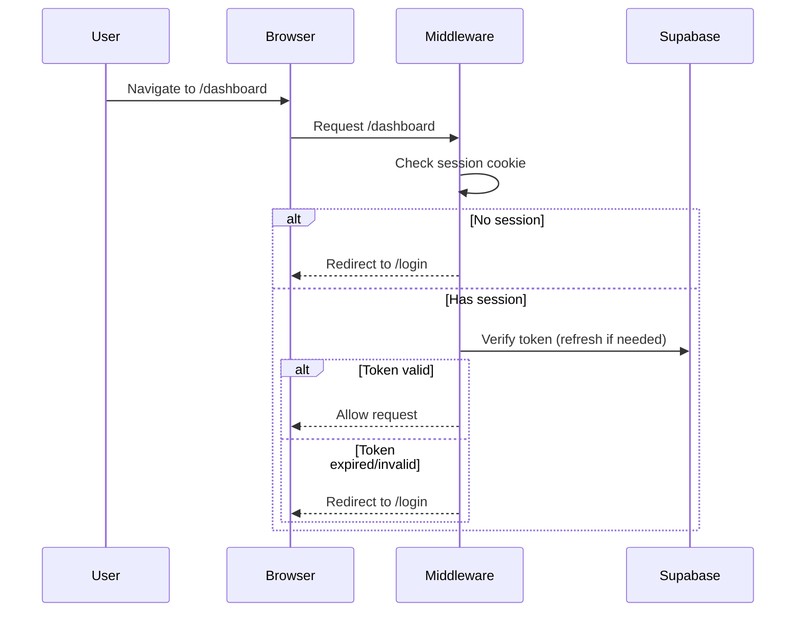

# 04 — Dashboard Roadmap: Admin Module Scalability

> **Blueprint:** v1-conversion-redesign
> **Last Updated:** 2026-02-27
> **Status:** Draft — Pending Review

---

## 1. Data Entity Relationships

### 1.1 Entity-Relationship Diagram



### 1.2 Entity Relationships Summary

| Relationship | Type | Description |
|:-------------|:-----|:------------|
| Client → Orders | 1:N | One client can place many orders |
| Client → Leads | 1:N | One client can generate multiple quote leads |
| Order → Order Items | 1:N | Each order has one or more concrete line items |
| Order → Sale | 1:1 | Each fulfilled order generates exactly one sale record |
| Sale ↔ Expense | N:M (optional) | A sale can offset expenses; expenses can exist independently |
| Order → CAPI Dead Letters | 1:N (optional) | Failed tracking events linked to their source order |

### 1.3 Order Status Machine



---

## 2. Authentication, Session & RBAC

### 2.1 Authentication Flow



### 2.2 Session Management

| Property | Value | Rationale |
|:---------|:------|:----------|
| Session storage | HTTP-only cookie (Supabase default) | Server-accessible, XSS-resistant |
| Token refresh | Middleware on every request | Prevents mid-session expiry |
| Session duration | 7 days (configurable in Supabase) | Business appropriateness |
| Concurrent sessions | Allowed (no limit) | Mobile + Desktop use case |
| Logout | Clear cookie + Supabase `signOut()` | Ensure complete cleanup |

### 2.3 Role-Based Access Control (RBAC)

#### Role Definitions

| Role | Slug | Permissions |
|:-----|:-----|:------------|
| Owner | `owner` | Full access: CRUD on all entities, user management, settings |
| Admin | `admin` | CRUD on Orders, Sales, Clients, Expenses. Cannot manage users |
| Operator | `operator` | View Orders, update status (confirm/schedule/deliver). Read-only on financials |
| Viewer | `viewer` | Read-only access to all dashboard sections |

#### Implementation Strategy

Store the role in `user_metadata` on the Supabase `auth.users` record:

```json
{
    "full_name": "Ana García",
    "role": "admin"
}
```

**Validation Layer:** Server-side only (never trust client-side role claims).

```typescript
// lib/auth/rbac.ts
type Role = 'owner' | 'admin' | 'operator' | 'viewer';

const PERMISSIONS: Record<Role, string[]> = {
    owner:    ['orders:*', 'sales:*', 'clients:*', 'expenses:*', 'users:*', 'settings:*'],
    admin:    ['orders:*', 'sales:*', 'clients:*', 'expenses:*'],
    operator: ['orders:read', 'orders:update_status', 'clients:read'],
    viewer:   ['orders:read', 'sales:read', 'clients:read', 'expenses:read'],
};

export function hasPermission(userRole: Role, permission: string): boolean {
    const wildcard = permission.split(':')[0] + ':*';
    return PERMISSIONS[userRole]?.includes(permission) ||
           PERMISSIONS[userRole]?.includes(wildcard) || false;
}
```

**Guard in Server Actions:**

```typescript
// Example: createAdminOrder.ts
export async function createAdminOrder(payload: CreateOrderPayload) {
    const user = await getAuthenticatedUser();
    if (!hasPermission(user.role, 'orders:create')) {
        return { status: 'error', message: 'Insufficient permissions' };
    }
    // ... proceed
}
```

> [!IMPORTANT]
> RBAC **MUST** be enforced in Server Actions and Route Handlers, not in
> middleware. Middleware handles authentication (is the user logged in?).
> Server Actions handle authorization (is the user allowed to do this?).

---

## 3. Large Dataset Handling

### 3.1 Pagination Strategy

**Server-side cursor pagination** using Supabase's `.range()`:

```typescript
// app/actions/getMyOrders.ts — Enhanced
export async function getMyOrders(cursor?: string, pageSize = 25) {
    const query = supabase
        .from('orders')
        .select('*', { count: 'exact' })
        .order('created_at', { ascending: false })
        .limit(pageSize);

    if (cursor) {
        query.lt('created_at', cursor); // Cursor = last item's created_at
    }

    const { data, count, error } = await query;

    return {
        orders: data ?? [],
        totalCount: count ?? 0,
        nextCursor: data?.length === pageSize
            ? data[data.length - 1].created_at
            : null,
    };
}
```

**Why cursor-based (not offset)?**
- Offset pagination degrades at high page counts (`OFFSET 10000` scans 10K rows)
- Cursor pagination is O(1) regardless of position

### 3.2 UI Virtualization

For tables with 100+ rows visible, use a lightweight virtualization approach:

| Approach | Library | Bundle Cost | When to Use |
|:---------|:--------|:------------|:------------|
| Native windowing | CSS `content-visibility: auto` | 0 KB | Tables < 500 rows |
| Virtual scroll | `@tanstack/react-virtual` | ~5 KB | Tables > 500 rows |
| Full table framework | `@tanstack/react-table` | ~15 KB | When sorting/filtering/grouping needed |

**Phase 1 (v1):** Use CSS `content-visibility: auto` + server-side pagination.
This is zero-dependency and handles the expected data volumes (< 1000 orders).

**Phase 2 (v2):** If the dashboard grows to CRM-level data volumes, introduce
`@tanstack/react-table` with virtual scrolling.

### 3.3 Caching Strategy

| Data Type | Cache Strategy | TTL | Invalidation |
|:----------|:--------------|:----|:-------------|
| Orders list | `revalidate` (ISR) | 60s | On `createAdminOrder` / status update |
| Client details | `revalidate` | 300s | On client update |
| Price config | `revalidate` | 3600s | On DB update (rare) |
| Sales summary | `unstable_cache` | 300s | Manual revalidation |
| Expenses | `revalidate` | 60s | On new expense entry |

**Implementation:**

```typescript
// Next.js App Router caching for Server Components
export const revalidate = 60; // seconds

// OR for granular control:
import { unstable_cache } from 'next/cache';

const getCachedOrders = unstable_cache(
    async (userId: string) => getOrdersByUser(userId),
    ['orders'],
    { revalidate: 60, tags: ['orders'] }
);
```

**Cache Invalidation via Server Actions:**

```typescript
import { revalidateTag } from 'next/cache';

export async function createAdminOrder(payload: CreateOrderPayload) {
    // ... insert order
    revalidateTag('orders'); // Bust the cache
}
```

### 3.4 Search & Filtering

| Filter | Type | Implementation |
|:-------|:-----|:---------------|
| Status | Enum dropdown | Server-side `.eq('status', value)` |
| Date range | Date picker | Server-side `.gte()` / `.lte()` |
| Client search | Text input | Server-side `.ilike('name', '%query%')` |
| Folio search | Text input | Server-side `.eq('folio', value)` (exact match) |

**Debounce:** Text inputs debounced at 300ms to avoid excessive server requests.

---

## 4. Dashboard UI Architecture

### 4.1 Admin Shell Layout

```
┌──────────────────────────────────────────────┐
│  CEJ Dashboard            [Ana García ▾]     │  ← Top bar (user menu, logout)
├────────┬─────────────────────────────────────┤
│        │                                     │
│  📋    │   Pedidos                           │
│  💰    │   ┌─────────────────────────────┐   │
│  👥    │   │ Filtros: [Estado▾] [Fecha▾] │   │
│  📊    │   └─────────────────────────────┘   │
│  ⚙️    │                                     │
│        │   ┌─────────────┬───────┬───────┐   │
│        │   │ Folio       │Status │ Total │   │
│        │   ├─────────────┼───────┼───────┤   │
│ Sidebar│   │ CEJ-ABC123  │ Nuevo │ $12K  │   │
│ (icons │   │ CEJ-DEF456  │ Pagado│ $8.5K │   │
│  only  │   └─────────────┴───────┴───────┘   │
│  on    │                                     │
│  mobile│   [← Prev]  Página 1 de 12  [Next →]│
│  )     │                                     │
├────────┴─────────────────────────────────────┤
│  © 2026 CEJ Pro v0.4.0                       │
└──────────────────────────────────────────────┘
```

### 4.2 Dashboard Routing

| Route | Page | Component | Access |
|:------|:-----|:----------|:-------|
| `/dashboard` | Orders list | `OrdersPage` | `operator+` |
| `/dashboard/new` | Create order | `NewOrderPage` | `admin+` |
| `/dashboard/orders/[id]` | Order detail | `OrderDetailPage` | `operator+` |
| `/dashboard/clients` | CRM | `ClientsPage` | `operator+` |
| `/dashboard/clients/[id]` | Client detail | `ClientDetailPage` | `operator+` |
| `/dashboard/sales` | Sales report | `SalesPage` | `admin+` |
| `/dashboard/expenses` | Expense log | `ExpensesPage` | `admin+` |
| `/dashboard/payroll` | Payroll (future) | `PayrollPage` | `owner` |
| `/dashboard/settings` | Admin settings | `SettingsPage` | `owner` |

> [!NOTE]
> Routes `clients`, `sales`, `expenses`, `payroll`, and `settings` are **Phase 2+**
> expansions. Phase 1 implements only `/dashboard` (orders list) and
> `/dashboard/new` (create order), which already exist.
