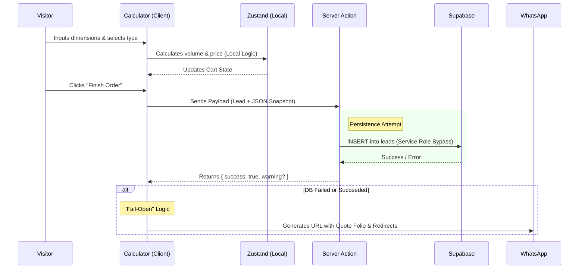

# Technical Architecture

## 1. Technology Stack

The architecture prioritizes client-side performance (Core Web Vitals) and server-side security.

- **Framework:** **Next.js 16** (App Router).
- **Language:** **TypeScript 5.9** (Strict Mode).
- **Styling:** **SCSS Modules** using a centralized Token System (`_tokens.scss`) and Mixins. **Note: No Tailwind is used.State Management:** **Zustand v5** with `persist` middleware.
    - **Single Store Strategy:** The store is shared between Marketing and App layouts to preserve user sessions context-wide.
- **Backend:** **Supabase** (PostgreSQL) integrated exclusively via **Server Actions**.
- **Validation:** **Zod** used for form inputs, API payloads, and Environment Variables.
- **Testing:** **Vitest** + React Testing Library for core logic (Pricing/Calculator).

## 2. Data Flow: Lead Capture (Fail-Open)

The system is designed to capture the lead even if the database layer fails, ensuring the user is always redirected to WhatsApp to close the sale.



## 3. Directory Structure

The project strictly separates the Marketing context from the SaaS Application context.

Bash

```tsx
├── app/
│   ├── (marketing)/      # Public Landing pages. Optimized for SEO/LCP.
│   ├── (app)/            # Private/Functional routes (/cotizador). Requires ToolShell.
│   ├── actions/          # Server Actions (DB Mutations). The only write-access point.
│   └── api/              # Route Handlers (Webhooks, CAPI).
├── components/
│   ├── Calculator/       # Complex Domain Logic & Forms.
│   ├── ui/               # Reusable Atoms (Buttons, Inputs, Cards).
│   └── layouts/          # Context-specific layouts (Header, Footer, Shells).
├── config/
│   ├── business.ts       # Static pricing & business rules.
│   └── env.ts            # Zod-validated environment variables.
├── lib/
│   ├── pricing.ts        # Pricing Engine (100% Unit Tested).
│   └── schemas.ts        # Zod Schemas (Single Source of Truth).
├── store/                # Zustand Stores.
└── types/                # Centralized Domain Types.
```

## 4. Development Standards

1. **Server Actions First:** Do not create API Routes for data mutation. Use `use server` files within `app/actions/`.
2. **Strict Validation:** All inputs entering the server must be validated against schemas in `lib/schemas.ts`.
3. **Fail-Open UX:** Critical paths (e.g., Send Order) must never block the user if a secondary service (DB, Pixel, Analytics) fails.
4. **Mobile-First SCSS:** Use the provided mixins (`@include respond-to('md')`) and avoid inline styles.
5. **Testing:** Any change to `lib/pricing.ts` MUST be accompanied by updated tests in `lib/pricing.test.ts`.
