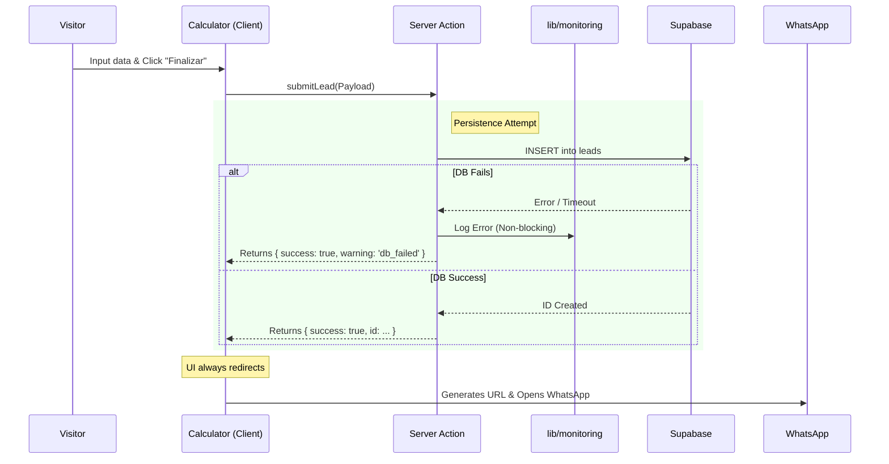

# Technical Architecture

## 1. Technology Stack

La arquitectura prioriza el rendimiento del lado del cliente (Core Web Vitals) y la seguridad del lado del servidor.

- **Framework:** **Next.js 16** (App Router).
- **Language:** **TypeScript 5.9** (Strict Mode).
- **Styling:** **SCSS Modules** usando un sistema centralizado de Tokens (`_tokens.scss`) y Mixins.
- **State Management:** **Zustand v5** con middleware `persist`.
    - **Single Store Strategy:** El store se comparte globalmente para preservar la sesión del usuario entre las rutas de Marketing y la App.
- **Backend:** **Supabase** (PostgreSQL) integrado exclusivamente vía **Server Actions**.
- **Validation:** **Zod** para inputs de formularios, payloads de API y variables de entorno.
- **Monitoring:** Abstracción ligera (`lib/monitoring.ts`) para reporte de errores sin bloquear la UI.

## 2. Patterns & Strategies

### The "Fail-Open" Logic (Lead Capture)

El sistema está diseñado para capturar el lead incluso si la base de datos falla, asegurando que el usuario siempre sea redirigido a WhatsApp para cerrar la venta.



### The "Global UI" Pattern

Para evitar la fragmentación de estado entre las páginas de Marketing (`/`) y la Aplicación (`/cotizador`), los componentes de feedback visual del carrito se inyectan en el `RootLayout`.

- **Componente:** `components/GlobalUI.tsx`
- **Ubicación:** `app/layout.tsx`
- **Responsabilidad:** Manejar `QuoteDrawer`, `SmartBottomBar` y `FeedbackToast` de forma persistente en toda la navegación.

## 3. Directory Structure

Plaintext

```tsx
├── app/
│   ├── (marketing)/      # Landing pages públicas.
│   ├── (app)/            # Rutas funcionales (/cotizador).
│   ├── actions/          # Server Actions (submitLead.ts). Único punto de escritura.
│   └── layout.tsx        # Root Layout + GlobalUI.
├── components/
│   ├── Calculator/       # Lógica compleja de dominio.
│   ├── GlobalUI.tsx      # Orquestador de componentes flotantes (Drawer/Toast).
│   ├── ui/               # Átomos reutilizables (Buttons, Inputs).
│   └── layouts/          # Shells específicos (ToolShell, Header).
├── lib/
│   ├── monitoring.ts     # Capa de abstracción para logging/errores.
│   ├── pricing.ts        # Motor de precios (100% Unit Tested).
│   └── schemas.ts        # Esquemas Zod (Single Source of Truth).
└── store/                # Zustand Stores (Persisted).
```

## 4. Development Standards

1. **Server Actions First:** No crear API Routes. Usar `use server` en `app/actions/`.
2. **Fail-Open UX:** Caminos críticos (Enviar Pedido) nunca deben bloquear al usuario si un servicio secundario falla.
3. **SCSS Modules Only:** No usar estilos en línea (`style={{}}`). Usar clases compuestas.
4. **Strict Typing:** Prohibido el uso de `any` en lógica de negocio (`store`, `pricing`, `actions`).
