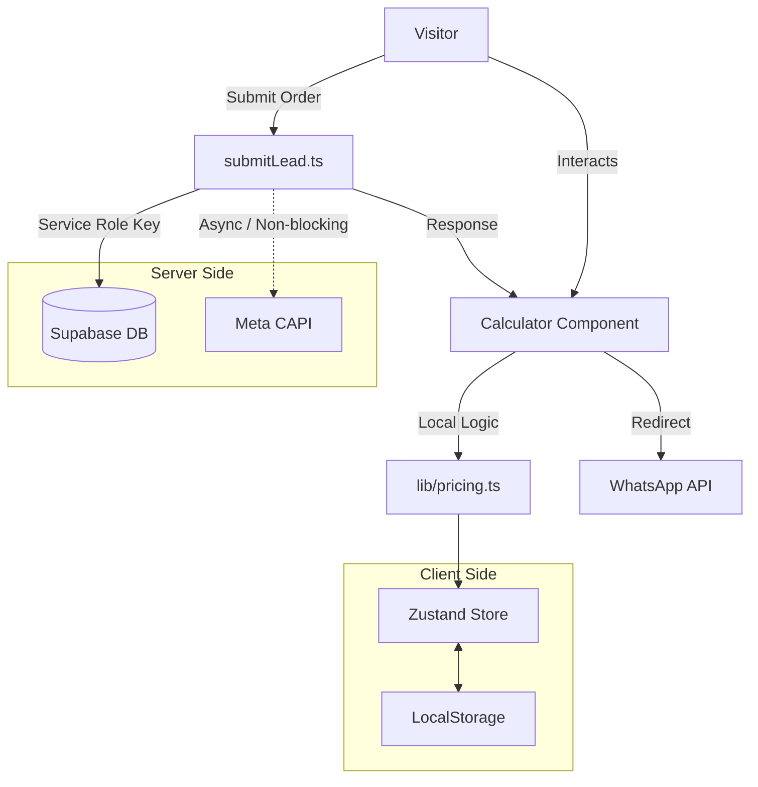

# Execution Guide: CEJ Platform

**Status:** Living Document
**Version:** 2.0 (Post-Audit)

## 1. Vision & Core Philosophy

**Product:** From `cej-landing` (Lead Gen) $\rightarrow$ `CEJ Pro` (SaaS).
**Goal:** Transform a high-performance landing page into a robust SaaS platform for concrete contractors in Ciudad Juárez.

### The "Fail-Open" Philosophy

We prioritize the user's ability to complete a quote and contact sales above all else.

- **Principle:** Technical failures (Database down, API timeout) must **never** block the primary conversion path (WhatsApp redirect).
- **Implementation:** All critical mutations (Lead Submission) must have graceful degradation paths.

## 2. Technical Stack & Standards

- **Framework:** Next.js 16 (App Router).
- **Language:** TypeScript 5.9 (Strict Mode). No `any`.
- **Styling:** **SCSS Modules** only.
    - **Constraint:** **No Tailwind CSS**. Adhere to `_tokens.scss` and `_mixins.scss`.
- **State:** Zustand v5 (with Persistence Middleware).
- **Backend:** Supabase (PostgreSQL) via **Server Actions**.
- **Validation:** Zod (Runtime schema validation for ALL inputs).

## 3. Architecture Overview

## 4. Execution Roadmap

We follow a strict, serialized playbook approach. Do not proceed to the next phase until the Exit Criteria of the current phase are met.

| **Phase** | **Playbook** | **Goal** | **Critical Dependency** |
| --- | --- | --- | --- |
| **0. Hardening** | `PLAYBOOK_00_QA_HARDENING.md` | Ensure math accuracy & A11y. | Existing Codebase |
| **1. Data Core** | `PLAYBOOK_01_DATA_CORE.md` | Zero-loss data capture (DB). | Supabase Keys |
| **2. Engine** | `PLAYBOOK_02_CALC_ENGINE.md` | Expert features (Additives). | Phase 1 Data Structure |
| **3. Marketing** | `PLAYBOOK_03_MARKETING_OPS.md` | Server-side Tracking (CAPI). | Facebook Access Token |
| **4. SaaS** | `PLAYBOOK_04_SAAS_PORTAL.md` | User Auth & History. | Phase 2 Pricing |

## 5. Development Protocol

1. **Read the Playbook:** Before coding, read the specific markdown file for the active phase.
2. **Type-First Development:** Define Zod schemas and TypeScript interfaces before writing logic.
3. **Strict Logs:** Use structured logging for server actions to debug "Fail-Open" scenarios.
    - *Format:* `[MODULE:ACTION] <Status> | Payload: {...}`
4. **Sync Rules:**
    - If you modify `lib/pricing.ts`, you **MUST** update `lib/pricing.test.ts`.
    - If you modify the DB Schema, update `DB_SCHEMA.md` immediately.
