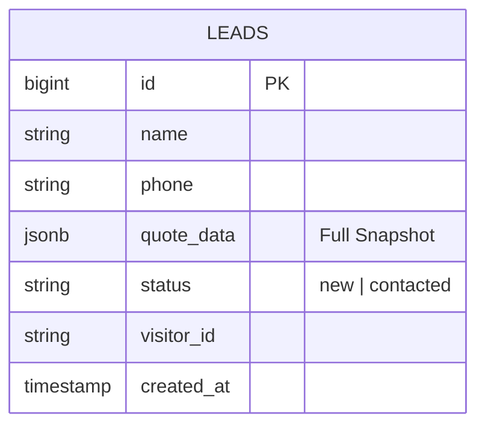

# Playbook 01: Data Core (Persistence)

**Status:** Planned (Blocked by Phase 0)
**Context:** Connects the "Fail-Open" calculator to Supabase.

## 1. Architecture: The Audit Trail

We need to capture every quote generated, even if the user doesn't complete the purchase. This is an **Audit Trail**, not just an Order System.

### Data Model

## 2. Implementation Specs

### 2.1 Environment Security

- **File:** `config/env.ts`
- **Requirement:** Validate `SUPABASE_SERVICE_ROLE_KEY` but **ensure it is not prefixed** with `NEXT_PUBLIC_`. It must remain server-side only.

### 2.2 Server Action: `submitLead.ts`

This is the most critical file in this phase. It acts as the bridge between the insecure client and the secure database.

- **Security Requirement:** Initialize the Supabase client with `persistSession: false`.TypeScript

    #

    `// app/actions/submitLead.ts (Snippet)
    const supabase = createClient(
      env.NEXT_PUBLIC_SUPABASE_URL,
      env.SUPABASE_SERVICE_ROLE_KEY, // Server-only key
      {
        auth: {
          persistSession: false, // CRITICAL: Prevent shared state
          autoRefreshToken: false,
        }
      }
    );`

- **Logic Flow:**
    1. **Validate:** Parse input with `OrderSubmissionSchema` (Zod). Return `{ success: false, error: ... }` if invalid.
    2. **Connect:** Check DB connection.
    3. **Insert:** Write to `public.leads`.
    4. **Fail-Open Handling:**
        - `try/catch` the entire block.
        - If DB fails, log error to console (or Sentry).
        - **Return:** `{ success: true, warning: 'db_down', folio: ... }`.
        - *Rationale:* The UI must receive "success" to proceed to WhatsApp generation.

### 2.3 Client Integration

- **File:** `hooks/useCheckOut.ts`
- **Update:**
    - Generate `folio` on the client (or optimistic ID).
    - Call `submitLead`.
    - If response has `warning`, log it to analytics but **do not alert the user**.
    - Redirect to WhatsApp immediately.

## 3. Exit Criteria

1. Submitting a form creates a row in Supabase `leads`.
2. The `quote_data` column contains a complete JSON snapshot of the calculation.
3. **Integration Test:** Manually breaking the DB connection (e.g., bad URL in `.env`) results in a successful WhatsApp redirect (Fail-Open verified).
