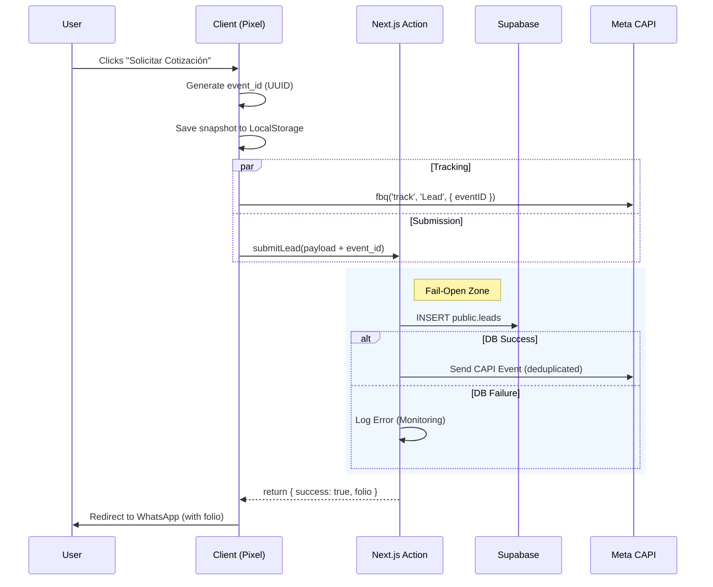
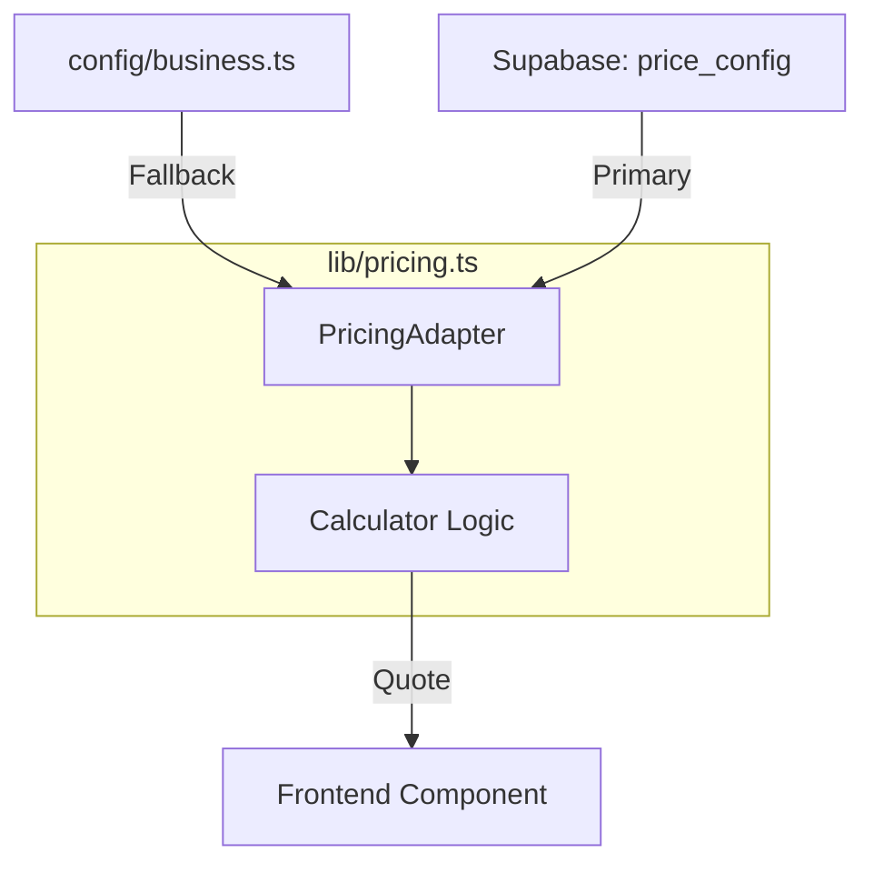

# Technical Architecture

## 1. Technology Stack

- **Framework:** Next.js 16 (App Router)
- **Language:** TypeScript 5.9
- **Styling:** SCSS Modules (`_tokens.scss`, `_primitives.scss`)
- **State:** Zustand v5 (with `persist` middleware)
- **Backend:** Supabase (Postgres + Auth), accessed via Server Actions
- **Analytics:** GA4 + Meta Pixel (browser) + CAPI (server)

---

## 2. Architecture & Data Flow

### 2.1 Core System Flow (Mermaid)

The following sequence illustrates the "Fail-Open" submission and hybrid tracking logic.

### 2.2 Component Lifecycle (Quote → Lead → WhatsApp)

While the diagram above shows the system boundaries, this flow describes the data journey through the React components:

1. **Calculator Form** (`components/Calculator/CalculatorForm.tsx`) 1
    - Captures inputs (mode, volume, strength, type, additives).
    - Uses `useQuoteCalculator` to compute a `Quote` object and warnings.
2. **Cart & History** (`store/useCejStore.ts`) 2
    - Adds the current quote as a cart item.
    - Maintains history of previous quotes via Zustand persistence.
3. **Checkout Modal** (`LeadFormModal` + `useCheckoutUI`) 3
    - Captures name and phone.
    - Calls `useCheckoutUI.processOrder`.
4. **Server Action** (`submitLead`) 4
    - Validates payload with `OrderSubmissionSchema`.
    - Stores `quote_data` snapshot in `leads`.
    - Optionally calls Meta CAPI with hashed PII.
5. **WhatsApp Handoff** 5
    - Builds a prefilled message including folio, items and total.
    - Opens `wa.me` link for the configured `NEXT_PUBLIC_WHATSAPP_NUMBER`.

### 2.3 Pricing Engine (Dependency Injection)

We decouple the *calculation logic* from the *price data* to enable dynamic updates without code deployments.

Fragmento de código

---

## 3. Folder Structure Standards

To ensure maintainability during the SaaS scaling phases:

1. Folder-per-Component

    Complex components (such as Header) must live in their own directory containing both .tsx and .module.scss.

    - ✅ `components/layouts/header/Header.tsx`
    - ❌ `components/layouts/Header.tsx` (flat file)
2. No Typos

    Directory names must be consistent and intentional (ToolShell, not ToolSheel).

3. Barrel Files

    Use index.ts sparingly and mostly for library-style exports, e.g. lib/schemas/index.ts.

4. Colocation

    Tests (.test.ts / .spec.ts) should live next to the file they test.

---

## 4. Core Patterns

4.1 Fail-Open Persistence 6

Lead submission uses:

- **DB path:** Insert into `leads` table.
- **CAPI path:** Fire Meta CAPI with hashed PII and `event_id`.

If Supabase is not configured or write fails:

- Errors are logged with `reportError` / `reportWarning`.
- The action still returns `success: true` so the WhatsApp handoff is never blocked.

4.2 Global UI Orchestrator 7

`components/layouts/GlobalUI.tsx` is mounted once at the root (`app/layout.tsx`) and contains:

- `FeedbackToast`
- `QuoteDrawer`
- `SmartBottomBar`

This prevents losing cart state when navigating between:

- Marketing routes (`app/(marketing)/*`)
- Internal tool routes (`app/(app)/*`, future CEJ Pro)

4.3 Domain Separation 8

- `lib/schemas/calculator.ts`: Input validation for physical and geometric constraints (dimensions, area, thickness, m³).
- `lib/schemas/orders.ts`: Validation for business payloads (leads, quotes, financials, tracking, privacy).
- `lib/pricing.ts`: Pricing engine (Min Order Quantity, Rounding, Additives).
- `app/actions/submitLead.ts`: Server action to persist leads and trigger CAPI.

---

5. Future Extensions 9

- **Phase 4 – SaaS Portal (Active)**
  - Link `leads` and `orders` to authenticated `profiles`.
  - Enable CEJ Pro dashboards over the same data model.
- **Phase 5 – Admin & Logistics**
  - CRUD UI over `price_config`.
  - Support for seasonal pricing and zone-based freight rules.
