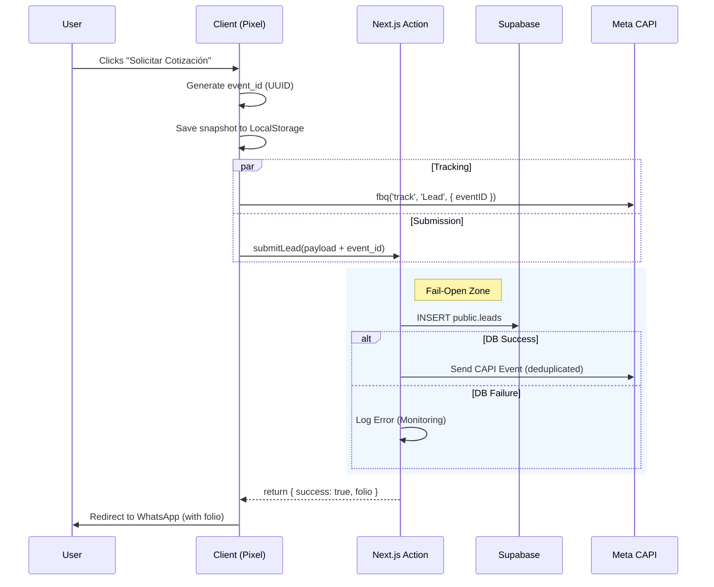
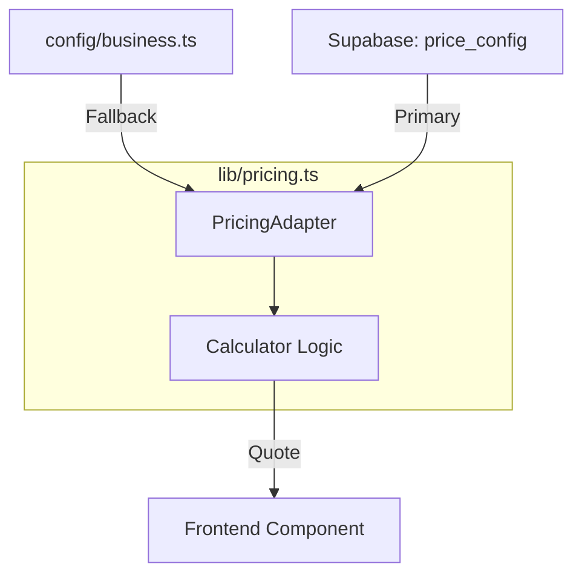

# Technical Architecture

## 1. Technology Stack

- **Framework:** Next.js 16 (App Router)
- **Language:** TypeScript 5.9
- **Styling:** SCSS Modules (`_tokens.scss`, `_primitives.scss`)
- **State:** Zustand v5 (with `persist` middleware)
- **Backend:** Supabase (Postgres + Auth), accessed via Server Actions
- **Analytics:** GA4 + Meta Pixel (browser) + CAPI (server)

---

## 2. Architecture & Data Flow

### 2.1 Core System Flow (Mermaid)

The following sequence illustrates the "Fail-Open" submission and hybrid tracking logic.

### 2.2 Component Lifecycle (Quote → Lead → WhatsApp)

While the diagram above shows the system boundaries, this flow describes the data journey through the React components:

1. **Calculator Form** (`components/Calculator/CalculatorForm.tsx`)
    - Captures inputs (mode, volume, strength, type, additives).
    - Uses `useQuoteCalculator` to compute a `Quote` object and warnings.
2. **Cart & History** (`store/useCejStore.ts`)
    - Adds the current quote as a cart item.
    - Maintains history of previous quotes via Zustand persistence.
3. **Checkout Modal** (`LeadFormModal` + `useCheckoutUI`)
    - Captures name and phone.
    - Calls `useCheckoutUI.processOrder`.
4. **Server Action** (`submitLead`)
    - Validates payload with `OrderSubmissionSchema`.
    - Stores `quote_data` snapshot in `leads`.
    - Optionally calls Meta CAPI with hashed PII.
5. **WhatsApp Handoff**
    - Builds a prefilled message including folio, items and total.
    - Opens `wa.me` link for the configured `NEXT_PUBLIC_WHATSAPP_NUMBER`.

### 2.3 Pricing Engine (Dependency Injection)

We decouple the *calculation logic* from the *price data* to enable dynamic updates without code deployments.

---

## 3. Folder Structure Standards

To ensure maintainability during the SaaS scaling phases:

1. **Folder-per-Component:** Complex components must live in their own directory.
    - ✅ `components/layouts/header/Header.tsx`
    - ❌ `components/layouts/Header.tsx`
2. **No Typos:** Directory names must be consistent.
3. **Barrel Files:** Use `index.ts` sparingly (e.g., `lib/schemas/index.ts`).
4. **Colocation:** Tests live next to the file they test.

---

## 4. Core Patterns

### 4.1 Fail-Open Persistence

Lead submission uses a dual path (DB + CAPI). If Supabase is unreachable, errors are logged via `reportError`, but the action returns `success: true` to prevent blocking the user's WhatsApp handoff.

### 4.2 Global UI Orchestrator

`components/layouts/GlobalUI.tsx` is mounted at `app/layout.tsx` to preserve state (Cart, Toasts) across route transitions.

### 4.3 Domain Separation

- `lib/schemas/*`: Zod definitions.
- `lib/pricing.ts`: Pure math engine.
- `lib/logic/*`: Application Services (e.g. `orderDispatcher`).
- `app/actions/*`: Server-side mutations.

---

## 5. Routing Architecture

We use Next.js **Route Groups** to separate concerns without affecting the URL structure:

- **`(marketing)`**: Public landing pages (`/`, `/aviso-de-privacidad`). Focus on SEO and conversion.
- **`(app)`**: Functional tools (`/cotizador`, `/perfil`). Focus on utility and state management.
- **`app/actions`**: Server-side mutations.
- **`proxy.ts`**: Global routing boundary (Next.js 16). Handles session refresh and dashboard protection.

---

## 6. Data Strategy & Persistence

### 6.1 Identity Management (Cookies)

To support the Hybrid Tracking model (Pixel + CAPI) for anonymous users, we manage identity via strictly first-party cookies:

- **`cej_vid` (Visitor ID):**
  - *Scope:* Persistent (1 year).
  - *Purpose:* Identifies the device/browser across sessions.
- **`cej_sid` (Session ID):**
  - *Scope:* Ephemeral (30 minutes).
  - *Purpose:* Groups interactions into a single session for attribution.
- *Implementation:* `lib/tracking/identity.ts`

### 6.2 State Migration Policy (Zustand)

The `useCejStore` utilizes `persist` middleware to save the cart to `localStorage`.

- **Versioning:** The store has a `version` number.
- **Migration Rule:** When introducing breaking changes to the state shape (e.g., adding `additives` array or Auth fields), you **MUST**:
    1. Increment the `version` in `useCejStore.ts`.
    2. Write a migration handler in the `migrate` function to transform the old state to the new schema.
- *Risk:* Failure to migrate will cause a "Hydration Error" or wipe the user's data.

---

## 7. Monitoring & Error Handling

We use a centralized error reporting utility to maintain the "Fail-Open" philosophy.

- **Utility:** `lib/monitoring.ts` -> `reportError(error, context)`
- **Usage:**
  - **Server Actions:** Wrap DB calls in `try/catch` and use `reportError`. Do not throw unless the error is critical to the user (e.g., Invalid Input).
  - **Client Components:** Use for non-blocking UI failures (e.g., tracking pixel failure).

---

## 8. Architectural Decisions

### 8.1 Repository Pattern (Deferred)

**Decision:** Partial implementation deferred to the start of **Phase 4.3**.

#### Context

The current system (Phase 4A) is simple enough that a Repository layer would introduce unnecessary abstraction ("over-engineering"). However, upcoming requirements for Phase 4B (multi-tenant, complex billing) will mandate better separation of concerns.

#### Rationale

- **Current State:**
  - Single access point (`submitLead` Server Action).
  - No logic duplication in queries.
  - Testability is high with current mocks.
- **Trigger for Adoption:**
  - Start of **Phase 4.3**.
  - OR when **≥ 3 Server Actions** access the same entity (e.g., Orders).
  - OR when complex caching/invalidation rules are introduced.

#### Implementation Strategy (Phase 4.3)

When triggered, the implementation will focus on specific high-priority domains:

| Domain | Scope | Justification |
| :--- | :--- | :--- |
| **Orders** | **In Scope** | Complex CRUD (create, status machine, read). |
| **Profiles** | **In Scope** | Update logic + PII/Privacy compliance. |
| **Pricing** | **In Scope** | Read-only adapter (already exists, will formalize). |
| **Leads** | Out of Scope | Write-only, low complexity. |
| **Cart** | Out of Scope | Client-side only (Zustand). |

#### Risks

- **Doing it now:** Disruption to Phase 4A velocity; frequent API changes.
- **Deferring:** Minor refactor cost later, considered acceptable given low current complexity.
