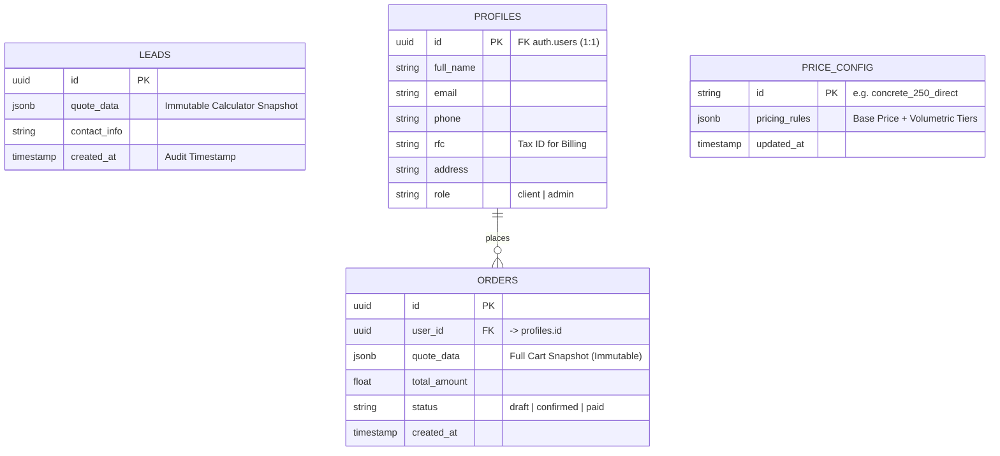

# Database Schema

The database architecture leverages PostgreSQL (hosted via Supabase) to manage the critical lifecycle of customer data.
It supports the hybrid model of "Phase 2" (anonymous lead generation) and "Phase 4" (authenticated SaaS platform).
The schema prioritizes data integrity for financial calculations and strict privacy controls for user data, ensuring that historical quotes remain immutable even as current price configurations evolve.

## 1. Entity-Relationship Diagram (Simplified)

The following diagram illustrates the core relationships.
`LEADS` operates independently for anonymous traffic, while `PROFILES` and `ORDERS` form the backbone of the **CEJ Pro** (SaaS) platform.



## 2. Core Tables

### `public.leads` (Active)

This table serves as the primary inbox for all anonymous activity generated by the public calculator.

It acts as a high-fidelity audit log for sales attribution and dispute resolution.

- Purpose: To provide a permanent, unalterable record of every quote generated by web visitors.

    This enables the sales team to audit the exact parameters a customer saw on their screen (price, volume, specific additives) if a discrepancy arises later via WhatsApp.

- **Key Column:** `quote_data` (JSONB).
- Why JSONB? Instead of normalizing quote items into separate relational tables, we store the entire calculator state as a JSON document.

    This creates a "frozen" snapshot. If the business changes the price of concrete next week, this record ensures we know exactly what price was quoted today.

- **Structure:** It mirrors the Zod schema used in the frontend application to ensure type safety across the stack.

**Security:** This table operates under a "Write-Only" model for the public.

- **Service Role Access:** The frontend application cannot read from this table.
- **Data Insertion:** Data is inserted exclusively via Server Actions using the Supabase Service Role key.
- **Privacy:** This bypasses Row Level Security (RLS) only for insertion, protecting Personally Identifiable Information (PII) like phone numbers from being exposed to the browser.

**JSONB Structure (`quote_data`):**

```json
{
  "folio": "WEB-20231025-ABCD",
  "customer": {
    "name": "Juan Perez",
    "phone": "6561234567"
  },
  "items": [
    {
      "id": "uuid-item-1",
      "label": "Concreto f'c 200 (Tiro Directo)",
      "volume": 5.5,
      "service": "direct",
      "subtotal": 15000.00,
      "additives": ["fiber", "accelerant_1pct"]
    }
  ],
  "financials": {
    "total": 17400.00,
    "currency": "MXN"
  },
  "metadata": {
    "source": "web_calculator",
    "userAgent": "Mozilla/5.0...",
    "pricing_version": 2
  }
}
```

### `public.price_config` (Provisioned - Future Source of Truth)

This table is the designated single source of truth for the pricing engine.

- **Status**: The table structure is provisioned in the SQL schema but is NOT YET CONNECTED to the frontend application flow.
- Current State: The application currently relies on a hardcoded configuration file (config/business.ts, specifically FALLBACK_PRICING_RULES).

    This ensures the application works immediately without database dependencies during the initial deployment.

- Migration Plan: Scheduled for Phase 4 (SaaS Portal). The frontend data fetching layer will be updated to query this table using Incremental Static Regeneration (ISR) or Stale-While-Revalidate (SWR) strategies.

    If it fails or is empty, it falls back to the local config.

- **Benefit**: This will allow business administrators to update prices (e.g., seasonal adjustments, inflation corrections) via a dashboard without requiring a developer to redeploy the entire application code.

> ⚠️ WARNING: Do not write to or rely on this table for production calculations until the Phase 4 migration is officially complete. Use config/business.ts for now.
>

### `public.profiles` & `public.orders` (Provisioned)

These tables form the core of the SaaS infrastructure scheduled for Phase 4.

- profiles: Maintains a 1-to-1 relationship with auth.users.

    It extends the basic authentication data to include business-specific fields required for invoicing in Mexico, such as the RFC (Tax ID) and fiscal address.

- orders: Represents the lifecycle of a confirmed job. Unlike leads, which are static snapshots, orders are mutable entities that track the state of a job from draft (initial calculation) to confirmed (deposit paid) and finally delivered.

    It includes geo_location data to assist logistics in locating the construction site.

## 3. Security & RLS Policies

**Row Level Security (RLS)** is strictly enforced to ensure multi-tenant isolation and data privacy.

### Anon Key (Public)

- **Policy**: Public read access on `price_config`.
- **Rationale**: Pricing is public marketing data; anonymous calculators must function without login.

### Service Role (Private/Server)

- **Usage**: Used exclusively within Server Actions (e.g., `submitLead`).
- **Rationale**: Anonymous writes to `leads` require bypassing RLS as there is no authenticated user context.

### Auth User (Authenticated)

- **Policy**: CRUD permissions restricted by `user_id` on `profiles` and `orders`.
- **Rationale**: A logged-in contractor has zero visibility into the data of other users.
