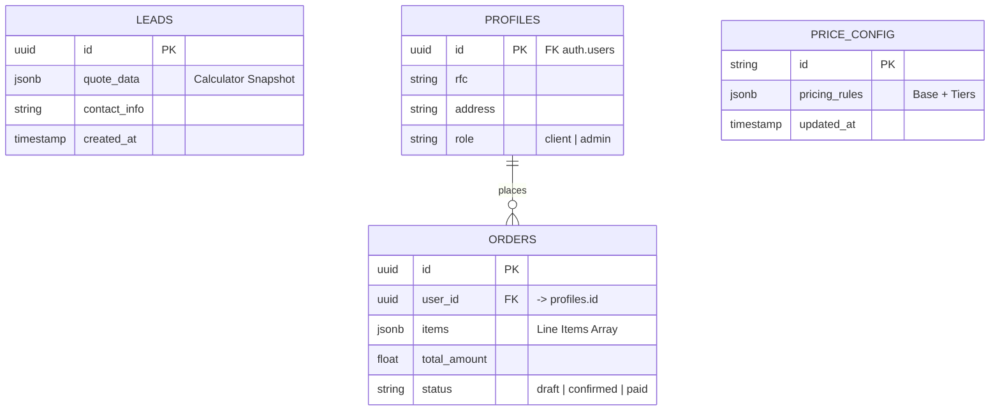

# Database Schema

The database utilizes PostgreSQL (via Supabase) and is architected to support the transition from anonymous leads to registered SaaS users without data loss.

## 1. Entity-Relationship Diagram (Simplified)



## 2. Table Definitions

### `public.leads` (Active)

Primary inbox for anonymous activity.

- **Purpose:** Audit trail and backup for web conversions.
- **Key Column:** `quote_data` (JSONB). Stores the *exact* calculator snapshot (inputs, formulas used, prices at that moment) to prevent future discrepancies if prices change.
- **Security:** Write-only via Server Action (Service Role). No public read access.

**JSONB Structure (`quote_data`):**

```tsx
{
  folio: string;
  customer: { name: string; phone: string; };
  items: Array<{
    id: string;
    label: string;
    volume: number;
    service: "direct" | "pumped";
    subtotal: number;
    additives: string[]; // Phase 2: Additives Support
  }>;
  financials: { total: number; currency: "MXN"; };
  metadata: { source: string; userAgent: string; pricing_version: number; };
}
```

### `public.price_config` (Provisioned - Future Source of Truth)

Source of truth for pricing.

- **Status:** Provisioned in SQL script. Currently, the application uses `config/business.ts` (FALLBACK_PRICING_RULES) as the adapter.
- **Migration Plan:** In Phase 3 (End), the frontend hook `usePricingRules` will attempt to fetch this table via ISR/SWR. If it fails or is empty, it falls back to the local config.

### `public.profiles` & `public.orders` (Provisioned)

Core tables for the SaaS Phase (Sprint 4).

## 3. Security & RLS Policies

- **Anon Key:** Only permits public read access on `price_config` (Future).
- **Service Role:** Used exclusively in Server Actions to write to `leads`, bypassing public RLS restrictions to prevent spam.
- **Auth User:** Will have CRUD permissions limited strictly to their own records in `orders` and `profiles`.
