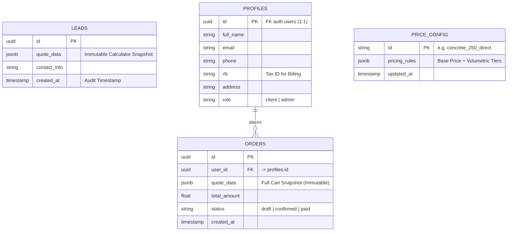

# Database Schema

The database architecture leverages PostgreSQL (hosted via Supabase) to manage the critical lifecycle of customer data.
It supports the hybrid model of "Phase 2" (anonymous lead generation) and "Phase 4" (authenticated SaaS platform).
The schema prioritizes data integrity for financial calculations and strict privacy controls for user data, ensuring that historical quotes remain immutable even as current price configurations evolve.

## 1. Entity-Relationship Diagram (Simplified)

The following diagram illustrates the core relationships.
`LEADS` operates independently for anonymous traffic, while `PROFILES` and `ORDERS` form the backbone of the **CEJ Pro** (SaaS) platform.


```mermaid
erDiagram
    LEADS {
        uuid id PK
        jsonb quote_data "Immutable Calculator Snapshot"
        string contact_info
        timestamp created_at "Audit Timestamp"
    }
    PROFILES {
        uuid id PK "FK auth.users (1:1)"
        string full_name
        string email
        string phone
        string rfc "Tax ID for Billing"
        string address
        string role "client | admin"
    }
    ORDERS {
        uuid id PK
        uuid user_id FK "-> profiles.id"
        jsonb quote_data "Full Cart Snapshot (Immutable)"
        float total_amount
        string status "draft | confirmed | paid"
        timestamp created_at
    }
    PRICE_CONFIG {
        string id PK "e.g. concrete_250_direct"
        jsonb pricing_rules "Base Price + Volumetric Tiers"
        timestamp updated_at
    }

    PROFILES ||--o{ ORDERS : places
```

## 2. Core Tables

### `public.leads` (Active)

This table serves as the primary inbox for all anonymous activity generated by the public calculator.

It acts as a high-fidelity audit log for sales attribution and dispute resolution.

- Purpose: To provide a permanent, unalterable record of every quote generated by web visitors.

    This enables the sales team to audit the exact parameters a customer saw on their screen (price, volume, specific additives) if a discrepancy arises later via WhatsApp.

- **Key Column:** `quote_data` (JSONB).
- Why JSONB? Instead of normalizing quote items into separate relational tables, we store the entire calculator state as a JSON document.

    This creates a "frozen" snapshot. If the business changes the price of concrete next week, this record ensures we know exactly what price was quoted today.

- **Structure:** It mirrors the Zod schema used in the frontend application to ensure type safety across the stack.

**Security:** This table operates under a "Write-Only" model for the public.

- **Service Role Access:** The frontend application cannot read from this table.
- **Data Insertion:** Data is inserted exclusively via Server Actions using the Supabase Service Role key.
- **Privacy:** This bypasses Row Level Security (RLS) only for insertion, protecting Personally Identifiable Information (PII) like phone numbers from being exposed to the browser.

**JSONB Structure (`quote_data`):**

```json
{
  "folio": "WEB-20231025-ABCD",
  "customer": {
    "name": "Juan Perez",
    "phone": "6561234567"
  },
  "items": [
    {
      "id": "uuid-item-1",
      "label": "Concreto f'c 200 (Tiro Directo)",
      "volume": 5.5,
      "service": "direct",
      "subtotal": 15000.00,
      "additives": ["fiber", "accelerant_1pct"]
    }
  ],
  "financials": {
    "total": 17400.00,
    "currency": "MXN"
  },
  "metadata": {
    "source": "web_calculator",
    "userAgent": "Mozilla/5.0...",
    "pricing_version": 2
  }
}
```

### `public.price_config` (Active - Initial Data Seeded)

This table is the designated single source of truth for the pricing engine.

- **Status**: The table structure is live and data has been seeded. Connection to frontend is in progress.
- Current State: The application currently relies on a hardcoded configuration file (config/business.ts, specifically FALLBACK_PRICING_RULES).

    This ensures the application works immediately without database dependencies during the initial deployment.

- Migration Plan: Scheduled for Phase 4 (SaaS Portal). The frontend data fetching layer will be updated to query this table using Incremental Static Regeneration (ISR) or Stale-While-Revalidate (SWR) strategies.

    If it fails or is empty, it falls back to the local config.

- **Benefit**: This will allow business administrators to update prices (e.g., seasonal adjustments, inflation corrections) via a dashboard without requiring a developer to redeploy the entire application code.

> ⚠️ WARNING: Do not write to or rely on this table for production calculations until the Phase 4 migration is officially complete. Use config/business.ts for now.
>

### `public.profiles` & `public.orders` (Active)

These tables form the core of the SaaS infrastructure implemented in Phase 4B.

- profiles: Maintains a 1-to-1 relationship with auth.users.
- orders: Represents the lifecycle of a confirmed job.

### `public.order_payments`, `public.order_status_history`, `public.order_fiscal_data` (Active - Dual Write)

Operational sales and collections are now modeled with additive tables to preserve backward compatibility:

- `order_payments`: immutable ledger for `anticipo`, `abono`, `liquidacion`, `ajuste`, `refund`, `chargeback`.
- `order_status_history`: transition audit trail (`from_status` -> `to_status`) with actor and reason.
- `order_fiscal_data`: minimum fiscal capture for invoice request lifecycle (without PAC integration).

Additional additive fields on `orders` include:

- Capture and scheduling: `ordered_at`, `delivery_address_text`, `scheduled_window_start`, `scheduled_window_end`, `scheduled_slot_code`, `scheduled_time_label`.
- Financial summary: `payments_summary_json`, `balance_amount`, `payment_status`.
- Import idempotency: `import_source`, `import_batch_id`, `import_row_hash`.

## 3. Security & RLS Policies

RLS policy definitions in `docs/schema.sql` are maintained for **policy completeness and auditability**.
This improves governance clarity, but it does **not** override the service-role bypass behavior.
When a Server Action uses the service-role key, RLS is bypassed by PostgreSQL/Supabase design.

### Policy Matrix (Canonical Names)

| Table | RLS Enabled | Explicit Policies |
|---|---|---|
| `profiles` | Yes | `profiles service_role all` |
| `leads` | Yes | `leads service_role all` |
| `service_slots` | Yes | `service_slots service_role all` |
| `orders` | Yes | `orders service_role all` |
| `order_payments` | Yes | `order_payments service_role all` |
| `order_status_history` | Yes | `order_status_history service_role all` |
| `order_fiscal_data` | Yes | `order_fiscal_data service_role all` |
| `price_config` | Yes | `price_config public read`, `price_config service_role all` |
| `expenses` | Yes | `expenses service_role all` |
| `payroll` | Yes | `payroll service_role all` |

### Access Context Notes

- **Anon key**: only `price_config public read` is exposed for public pricing reads.
- **Service role**: used in server-only paths; policies are declared for auditable intent, while service-role access bypasses RLS internally.
- **Authenticated users**: user-context clients remain constrained by RLS and app-level RBAC checks.
