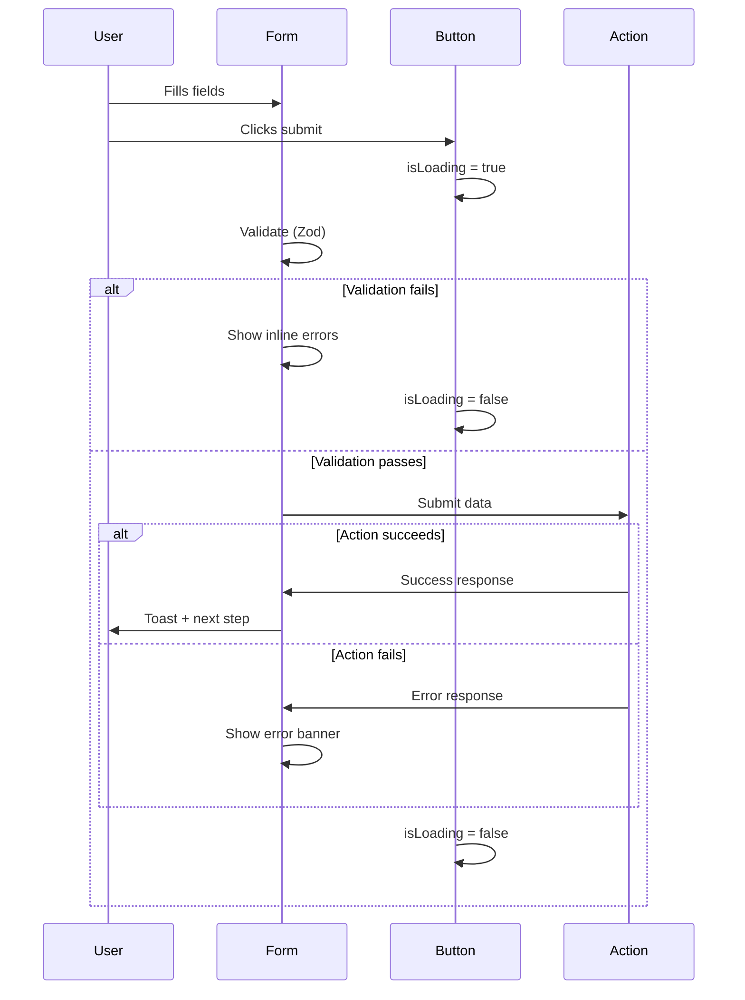

# UI Interaction Patterns

**Scope:** Standardized behaviors for forms, feedback, loading, errors, and navigation.
**Source of Truth:** `styles/_forms.scss`, `lib/schemas/*.ts`, Component implementations.

---

## 1. Form Validation Patterns

### 1.1 Validation Strategy

| Type | When | How |
| --- | --- | --- |
| **Client-side** | On submit | Zod schema validation |
| **Field-level** | On blur (optional) | Individual field rules |
| **Server-side** | On action | Zod + business rules |

### 1.2 Error Display Rules

┌─────────────────────────────────────────┐

│  Label                                  │

├─────────────────────────────────────────┤

│  ┌─────────────────────────────────────┐│

│  │ Input with red border              ││

│  └─────────────────────────────────────┘│

│  ⚠️ Mensaje de error (role="alert")     │

└─────────────────────────────────────────┘

**Timing:**

- Error appears immediately after validation fails
- Error animates in with `slideDown` (0.2s ease-out)
- Error persists until field is corrected

**Styling:**

- Border: `-c-error-text` or `-c-error-text-on-dark`
- Background: Subtle tint (`-c-error-soft`)
- Focus: Error border maintained, glow uses error color

### 1.3 Input State Machine

```mermaid
stateDiagram-v2
    [*] --> Default
    Default --> Focused: focus
    Focused --> Default: blur (valid)
    Focused --> Error: blur (invalid)
    Error --> Focused: focus
    Focused --> Disabled: disabled=true
    Default --> Disabled: disabled=true
```

---

## 2. Loading States

### 2.1 Button Loading

| **Scenario** | **Pattern** | **Visual** |
| --- | --- | --- |
| Quick action (<2s) | Spinner only | Centered spinner, content invisible |
| Long action (>2s) | Spinner + text | Inline spinner with `loadingText` |

**Implementation:**

```tsx
`<Button isLoading>Enviar</Button>           // Spinner only
<Button isLoading loadingText="Guardando...">  // Spinner + text`
```

### 2.2 Loading Feedback Timing

| **Duration** | **User Expectation** | **Pattern** |
| --- | --- | --- |
| 0-300ms | Instant | No indicator needed |
| 300ms-2s | Brief wait | Button spinner |
| 2s-10s | Noticeable wait | Spinner + progress text |
| >10s | Long operation | Consider async pattern |

### 2.3 Skeleton Loading (Future)

> Not yet implemented. Recommended for future phases:
>
> - Calculator form loading
> - Cart item loading
> - Price calculation loading

---

## 3. Feedback Patterns

### 3.1 Feedback Hierarchy

| **Priority** | **Type** | **Component** | **Duration** |
| --- | --- | --- | --- |
| 🔴 Critical | Error (blocking) | Inline message | Persistent |
| 🟡 Warning | Validation issue | Inline + form error | Until fixed |
| 🟢 Success | Action completed | Toast | 3 seconds |
| 🔵 Info | Neutral message | Toast or inline | 3-5 seconds |

### 3.2 Toast Behavior

**Current Implementation:** `FeedbackToast`

| **Property** | **Value** |
| --- | --- |
| Position | Top-right (desktop), Top-center (mobile) |
| Duration | 3 seconds |
| Animation | Slide in from right |
| Stacking | Single toast (replaces previous) |
| Role | `role="status"` (non-assertive) |

### 3.3 Error Message Text Guidelines

| **❌ Don't** | **✅ Do** |
| --- | --- |
| "Invalid input" | "Ingresa un número de 10 dígitos" |
| "Error occurred" | "No pudimos guardar tu pedido. Intenta de nuevo." |
| "Required" | "Este campo es obligatorio" |
| "Bad format" | "Usa el formato: 656 123 4567" |

---

## 4. Form Submission Flow

### 4.1 Standard Flow



### 4.2 Form States

| **State** | **Button** | **Fields** | **Errors** |
| --- | --- | --- | --- |
| Idle | Enabled | Editable | Hidden |
| Invalid | Disabled (optional) | Editable | Visible |
| Submitting | Loading | Disabled | Hidden |
| Error | Enabled | Editable | Visible (summary) |
| Success | - | - | - (redirect/close) |

---

## 5. Modal/Dialog Patterns

### 5.1 Open/Close Behaviors

| **Trigger** | **Behavior** |
| --- | --- |
| Backdrop click | Close modal |
| Escape key | Close modal |
| Close button | Close modal |
| Form submit success | Close modal + feedback |
| Form submit error | Keep open + show error |

### 5.2 Focus Management

1. **On Open:** Focus moves to first focusable element or dialog itself
2. **Trap:** Tab cycles within dialog only
3. **On Close:** Focus returns to trigger element

### 5.3 Scroll Lock

- Body scroll is locked via `useLockBodyScroll` hook
- Prevents background scrolling on mobile
- Restores on unmount

---

## 6. Selection Patterns

### 6.1 Radio Selection (SelectionCard)

| **Interaction** | **Result** |
| --- | --- |
| Click anywhere on card | Selects option |
| Keyboard Enter/Space | Selects focused option |
| Arrow keys | Navigate between options |

**Visual Feedback:**

- Selected: Accent border, subtle background
- Unselected: Muted border
- Focus: Visible focus ring

### 6.2 Toggle (ExpertToggle)

| **State** | **Visual** | **ARIA** |
| --- | --- | --- |
| Off (Básico) | Thumb left | `aria-pressed="false"` |
| On (+Aditivos) | Thumb right | `aria-pressed="true"` |

---

## 7. Navigation Patterns

### 7.1 Multi-Step Wizard (Calculator)

| **Navigation** | **Behavior** |
| --- | --- |
| Next | Validate current step → advance |
| Back | No validation → go back |
| Step indicator click | Disabled (linear flow) |

### 7.2 Drawer Navigation (QuoteDrawer)

| **Tab** | **Content** |
| --- | --- |
| `order` | Current cart items |
| `history` | Previous orders |

**Tab Switching:** Instant, no animation, content swap.

---

## 8. Responsive Behavior

### 8.1 Dialog Responsiveness

| **Breakpoint** | **Dialog Style** |
| --- | --- |
| Mobile (<768px) | Bottom sheet (swipe up) |
| Desktop (≥768px) | Centered modal |

### 8.2 Bottom Bar Visibility

| **Context** | **Visibility** |
| --- | --- |
| Mobile + cart has items | Visible |
| Mobile + cart empty | Hidden |
| Desktop (any) | Hidden (via CSS) |

---

## 9. Fail-Open UX Pattern

When backend operations fail, prioritize user momentum:

`┌─────────────────────────────────────────────────────────┐
│  USER ACTION → Try Backend → Success? → Continue        │
│                     ↓                                   │
│                   Fail?                                 │
│                     ↓                                   │
│              Log Error (Silent)                         │
│                     ↓                                   │
│              Continue Anyway (Fail-Open)               │
│                     ↓                                   │
│              WhatsApp Handoff (always works)           │
└─────────────────────────────────────────────────────────┘`

**Implementation:** Even if database write fails, user sees success and proceeds to WhatsApp.
