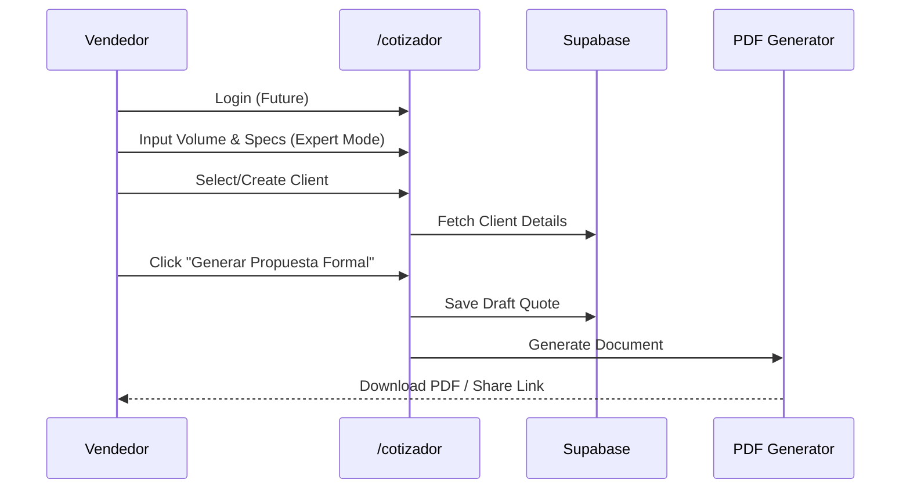

# Internal Quoter Tool (`/cotizador`)

**Role:** Specialized tool for internal staff, sales representatives, and trusted contractors.
**Goal:** Replace Excel calculators and generate formal, branded PDF proposals.

---

## 1. Core Differences vs Public Landing

| Feature | Public (`/`) | Internal (`/cotizador`) |
| :--- | :--- | :--- |
| **Audience** | Unknown visitors, self-service leads | Sales staff, power users |
| **Input Mode** | Guided wizard, simplified | **Expert Mode** (always on) |
| **Output** | Informal ticket, WhatsApp handoff | **Formal PDF**, detailed breakdown |
| **Price Visibility** | Estimated Total only | Full breakdown (Base + Additives + VAT) |
| **Customer Data** | Minimal (Name/Phone) | complete (RFC, Billing Address, Project Name) |
| **Persistence** | LocalStorage (Browser) | Database (User Profile + History) |

## 2. Feature Requirements

### 2.1 Expert Calculator

- **Additives Panel:** Always visible.
- **Manual Overrides:** (Future) Ability to theoretically adjust margin or price per project (requires permission).
- **Extended Validation:** Allows edge-case volumes (>50m³) with special warnings rather than hard blocks.

### 2.2 Formal Proposal Generation

- **PDF Generation:**
  - High-resolution header/footer.
  - "Vigencia" (Validity) date prominently displayed.
  - Legal terms and conditions attached.
  - Bank account details for transfer.
- **Project Metadata:**
  - `Project Name` (e.g., "Torre V2 - Losa Piso 4").
  - `Delivery Address` (map pin or text).

## 3. Workflow

## 4. Roadmap

- **Phase 1 (Current):** Standalone route `/cotizador` with `ExpertToggle` enabled by default.
- **Phase 2:** Authentication gating (Employee Login).
- **Phase 3:** PDF Generation engine (`@react-pdf/renderer` or server-side).
- **Phase 4:** CRM Integration (HubSpot/Odoo sync).
