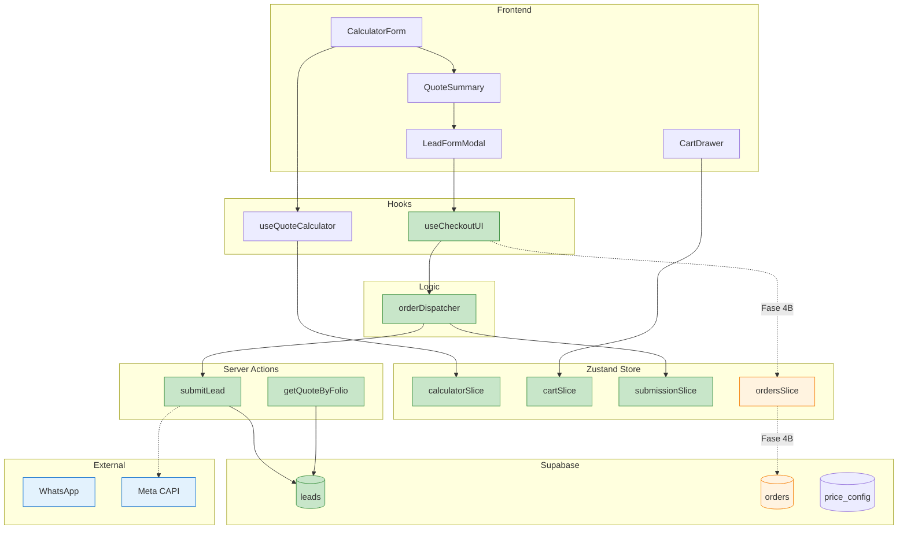
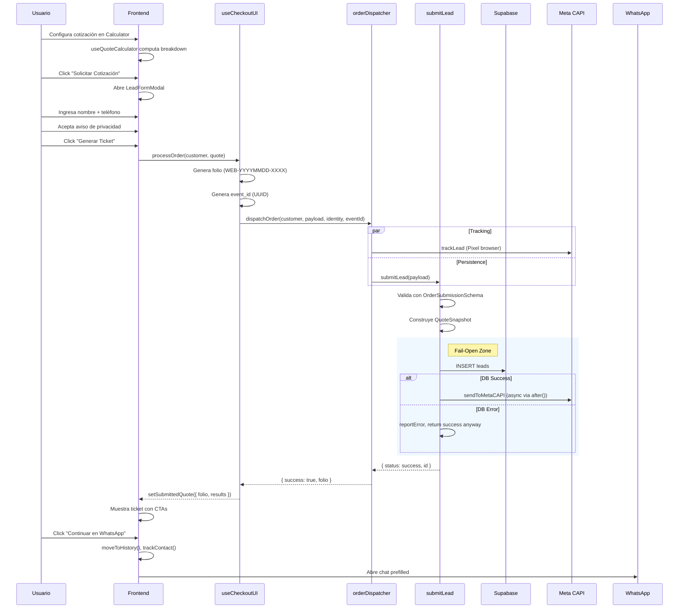
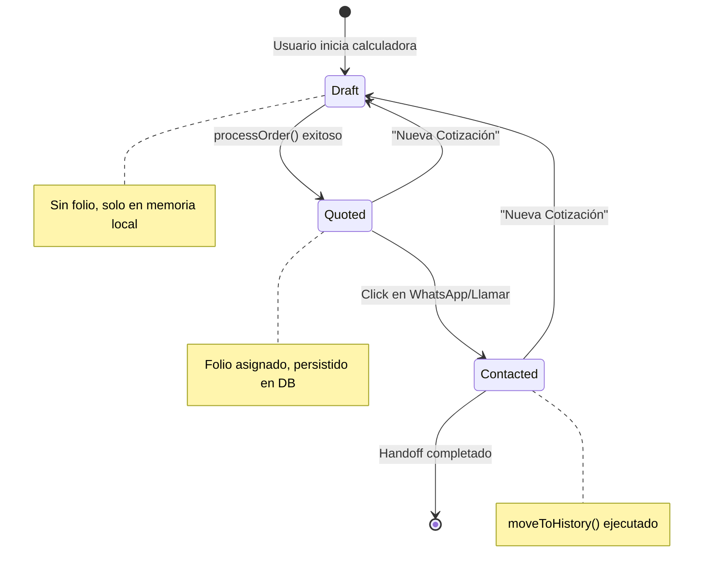
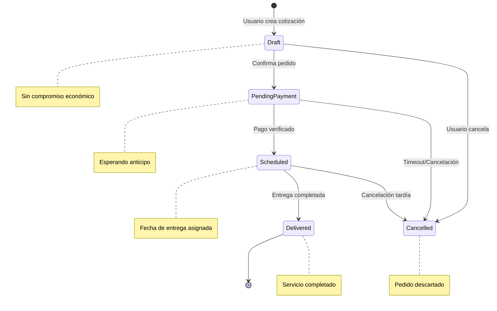
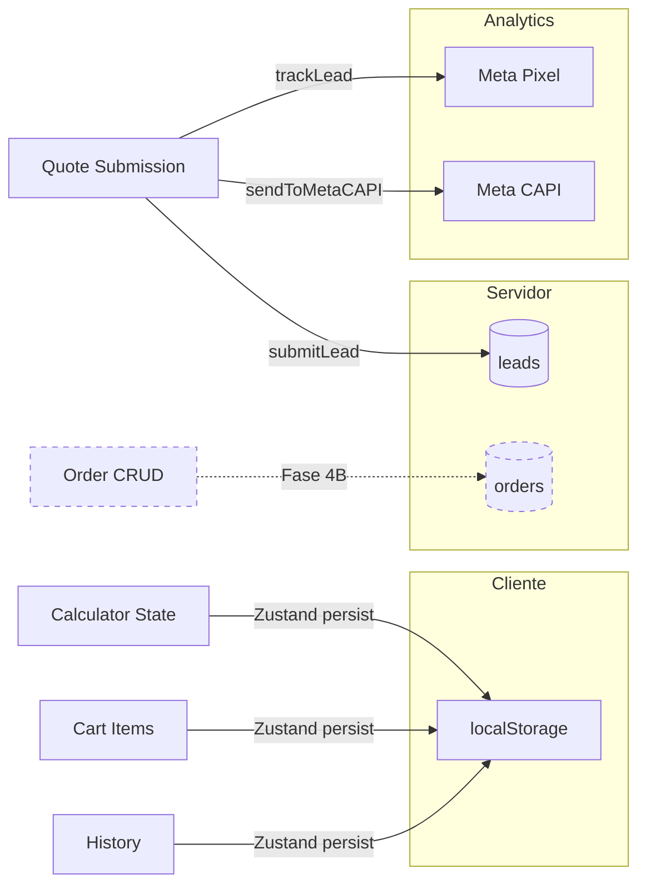
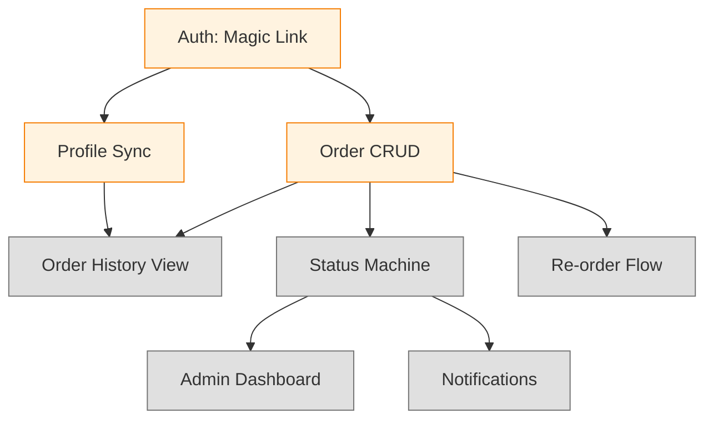
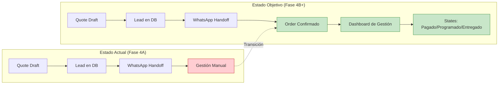

# Proceso de Administración de Pedidos

> **Última actualización:** 2024-12-18 | **Estado:** Documentación Activa

Este documento describe el proceso completo de administración de pedidos del sistema CEJ, incluyendo el estado actual, el objetivo a mediano plazo, y la evolución incremental planificada.

---

## 1. Resumen Ejecutivo

El sistema CEJ maneja **dos conceptos distintos** de "pedido":

| Concepto | Tabla | Estado | Autenticación | Descripción |
|:---------|:------|:-------|:--------------|:------------|
| **Lead** | `public.leads` | ✅ Activo | Anónimo | Cotización generada por visitante web |
| **Order** | `public.orders` | 📋 Provisionado | Requerida | Pedido formal de cliente autenticado |

### Estado Actual (Fase 4A - Local Pro)

- **Leads funcionan completamente**: Creación, persistencia, consulta por folio, handoff a WhatsApp.
- **Orders están provisionados**: Esquema de BD listo, tipos TypeScript definidos, slice de Zustand implementado, pero **no conectados al flujo de usuario**.

---

## 2. Arquitectura del Flujo Actual

### 2.1 Diagrama de Componentes



### 2.2 Flujo End-to-End Actual (Lead)



---

## 3. Estados del Pedido

### 3.1 Máquina de Estados - Lead (Actual)



| Estado | Nombre UI | Persistencia | Trigger |
|:-------|:----------|:-------------|:--------|
| `draft` | *Borrador* | localStorage | Usuario edita calculadora |
| `quoted` | *Cotización* | DB (`leads`) + localStorage | `processOrder()` exitoso |
| `contacted` | *Contactado* | localStorage (`history`) | Click en WhatsApp CTA |

### 3.2 Máquina de Estados - Order (Planificado para Fase 4B)



| Estado | DB Value | Descripción | Siguiente Acción |
|:-------|:---------|:------------|:-----------------|
| `draft` | `draft` | Cotización sin confirmar | Usuario confirma o descarta |
| `pending_payment` | `pending_payment` | Esperando anticipo | Verificar pago |
| `scheduled` | `scheduled` | Fecha/hora asignada | Ejecutar entrega |
| `delivered` | `delivered` | Servicio completado | Facturación |
| `cancelled` | `cancelled` | Cancelado | Archivar |

### 3.3 Estados de Pago (Planificado)

| Estado | Descripción |
|:-------|:------------|
| `Pendiente de Pago` | Sin pagos registrados |
| `Parcial` | Anticipo recibido, saldo pendiente |
| `Pagado` | 100% liquidado |
| `Cancelado` | Pedido cancelado (posible reembolso) |

---

## 4. Estructura de Datos

### 4.1 Lead (Actual)

```typescript
// types/database.ts - QuoteSnapshot
interface QuoteSnapshot {
    folio: string;
    customer?: {
        name: string;
        phone: string;  // Masked en consulta pública
        email?: string;
        visitorId?: string;
    };
    items: Array<{
        id: string;
        label: string;
        volume: number;
        service: string;
        subtotal: number;
    }>;
    financials: {
        subtotal: number;
        vat: number;
        total: number;
        currency: string;
    };
    breakdownLines?: Array<{
        label: string;
        value: number;
        type: 'base' | 'additive' | 'surcharge';
    }>;
    metadata?: Record<string, unknown>;
}
```

### 4.2 Order (Provisionado)

```typescript
// types/domain.ts - Order
interface Order {
    id: string;
    folio: string;
    createdAt: number;
    updatedAt: number;
    scheduledDate?: string;
    client: Client;
    deliveryLocation: Location;
    seller?: Seller;
    items: OrderItem[];
    financials: OrderFinancials;
    status: OrderStatus;
    paymentStatus: PaymentStatus;
    notes?: string;
}
```

### 4.3 Comparativa Lead vs Order

| Aspecto | Lead | Order |
|:--------|:-----|:------|
| **Autenticación** | Anónima | Requerida |
| **Mutabilidad** | Inmutable (snapshot) | Mutable (ciclo de vida) |
| **Propósito** | Captura de interés | Gestión operativa |
| **Trazabilidad** | Folio + visitor_id | user_id + folio + auditoría |
| **Campos fiscales** | ❌ | ✅ (RFC, facturación) |
| **Geolocalización** | ❌ | ✅ (delivery_address, geo_location) |
| **Estado** | Solo `status: new` | Máquina de estados completa |

---

## 5. Puntos de Persistencia y Trazabilidad



| Punto de Persistencia | Ubicación | Durabilidad | Trigger |
|:----------------------|:----------|:------------|:--------|
| **Draft State** | localStorage | Sesión/Dispositivo | Cada cambio en calculadora |
| **Cart Items** | localStorage | Sesión/Dispositivo | `addToCart()` |
| **History** | localStorage | Sesión/Dispositivo | `moveToHistory()` |
| **Lead Record** | `public.leads` | Permanente | `submitLead()` |
| **Order Record** | `public.orders` | Permanente | *Fase 4B* |

---

## 6. Roles y Responsabilidades

| Rol | Acciones Actuales | Acciones Planeadas (Fase 4B) |
|:----|:------------------|:----------------------------|
| **Usuario Anónimo** | Crear cotización, ver ticket, compartir por WhatsApp | — |
| **Usuario Autenticado** | — | Ver historial, re-ordenar, gestionar perfil |
| **Staff Interno** | Recibir leads via WhatsApp, actualizar manualmente (fuera del sistema) | Dashboard de pedidos, actualizar estados, asignar entregas |
| **Sistema** | Generar folio, persistir lead, enviar a CAPI | Transiciones automáticas, notificaciones, webhooks |

---

## 7. Reglas de Negocio y Validaciones

### 7.1 Validaciones Actuales

| Campo | Regla | Schema |
|:------|:------|:-------|
| `name` | Mínimo 3 caracteres | `OrderSubmissionSchema` |
| `phone` | Mínimo 10 dígitos | `OrderSubmissionSchema` |
| `privacy_accepted` | Debe ser `true` | `OrderSubmissionSchema` |
| `folio` | Formato `WEB-YYYYMMDD-XXXX` | `FolioParamSchema` |

### 7.2 Reglas de Negocio Actuales

1. **Fail-Open**: Si la base de datos falla, el usuario aún ve éxito y puede ir a WhatsApp.
2. **Deduplicación CAPI**: Mismo `event_id` en Pixel y CAPI para evitar conteo doble.
3. **Snapshot Inmutable**: `quote_data` congela precios al momento de la solicitud.
4. **Folio Único**: Generado con timestamp + random para evitar colisiones.

### 7.3 Reglas Planeadas (Fase 4B)

| Regla | Descripción |
|:------|:------------|
| **Mínimo de anticipo** | X% requerido para pasar a `scheduled` |
| **Ventana de cancelación** | 24h antes de entrega programada |
| **Límite de crédito** | Por cliente, basado en historial |
| **Volumen mínimo por entrega** | 3.5 m³ (ya implementado en pricing) |

---

## 8. Evolución Incremental

### 8.1 ✅ Qué se puede administrar HOY

| Capacidad | Estado | Ubicación |
|:----------|:-------|:----------|
| Crear cotización | ✅ Completo | `CalculatorForm` → `useQuoteCalculator` |
| Agregar al carrito | ✅ Completo | `cartSlice.addToCart()` |
| Editar/clonar item | ✅ Completo | `cartSlice.editCartItem()`, `cloneCartItem()` |
| Generar ticket con folio | ✅ Completo | `useCheckoutUI.processOrder()` |
| Persistir lead en DB | ✅ Completo | `submitLead()` → `leads` |
| Consultar por folio | ✅ Completo | `getQuoteByFolio()` |
| Compartir vía WhatsApp | ✅ Completo | WhatsApp prefilled URL |
| Historial local | ✅ Completo | `history` en Zustand |
| Reutilizar cotización | ✅ Completo | `cartSlice.loadQuote()` |

### 8.2 🚧 Qué falta para el flujo completo

| Capacidad | Estado | Dependencia |
|:----------|:-------|:------------|
| Autenticación (Magic Link) | 📋 Planificado | Supabase Auth integration |
| Sincronización cart ↔ DB | 📋 Planificado | Autenticación |
| CRUD de Orders | 📋 Provisionado | Autenticación + Repository Layer |
| Transiciones de estado (Order) | 📋 Provisionado | CRUD de Orders |
| Dashboard de administración | 📋 No iniciado | CRUD de Orders + Admin UI |
| Notificaciones (email/push) | 📋 No iniciado | Infraestructura de notificaciones |
| Facturación (CFDI) | 📋 No iniciado | Integración PAC |

### 8.3 Dependencias Técnicas



### 8.4 ⛔ Fuera de Alcance (No implementar aún)

| Feature | Razón |
|:--------|:------|
| Multi-tenancy (organizaciones) | Requiere validación de negocio |
| Facturación automática | Integración PAC pendiente |
| Integración ERP | Fuera del alcance del cotizador web |
| App móvil nativa | Enfoque actual es PWA/responsive |
| Pagos en línea | WhatsApp handoff es el flujo actual |

---

## 9. Diferencia: Estado Actual vs Estado Objetivo



---

## 10. Acciones Recomendadas (Próximos Pasos)

### Fase 4B - Cloud SaaS (Prioridad Alta)

1. **Implementar Auth (Magic Link)**
   - Integrar `supabase.auth.signInWithOtp()`
   - Crear página de callback `/auth/callback`
   - Sincronizar `profiles` al login

2. **Activar CRUD de Orders**
   - Conectar `ordersSlice` con Server Actions
   - Implementar `createOrder`, `updateOrderStatus`
   - Migrar de `leads` a `orders` para usuarios autenticados

3. **Dashboard de Historial**
   - Página `/dashboard/orders`
   - Filtros por estado, fecha
   - Acción de re-order

### Backlog (Prioridad Media)

4. **Repository Layer**
   - Formalizar acceso a `orders` y `profiles`
   - Trigger: ≥3 Server Actions accediendo a Orders

5. **Notificaciones**
   - Email de confirmación
   - Recordatorio de entrega

---

## 11. Documentos Relacionados

| Documento | Relación |
|:----------|:---------|
| [ARCHITECTURE.md](./ARCHITECTURE.md) | Stack técnico, Fail-Open pattern |
| [DB_SCHEMA.md](./DB_SCHEMA.md) | Estructura de tablas, RLS policies |
| [UX_FLOWS.md](./UX_FLOWS.md) | Flujos de usuario, estados de Quote |
| [ROADMAP.md](./ROADMAP.md) | Plan de sprints, Fase 4B |
| [VALIDATION.md](./VALIDATION.md) | Esquemas Zod, timing de validación |

---

## Changelog

| Fecha | Cambio |
|:------|:-------|
| 2024-12-18 | Documento inicial creado. Auditoría completa del sistema actual. |
