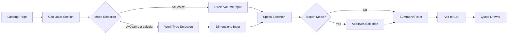
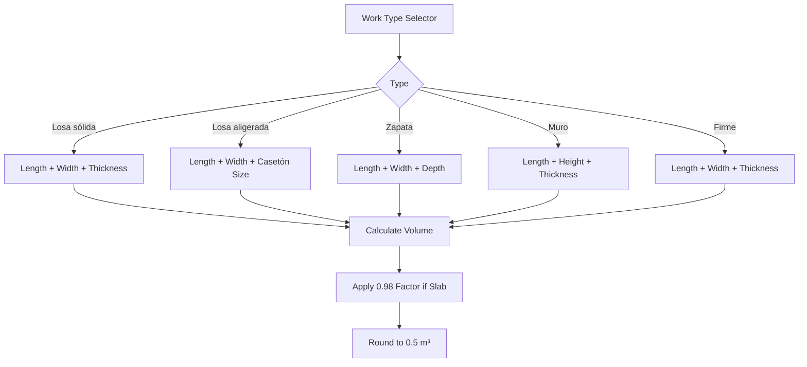
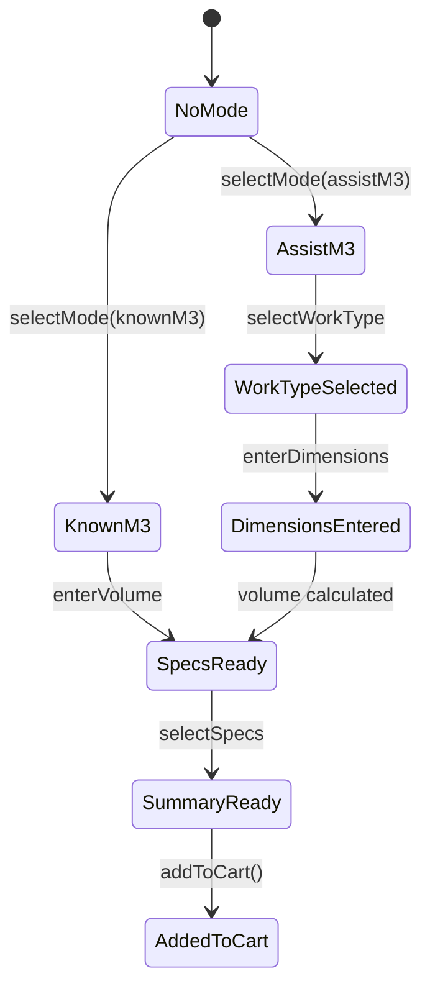
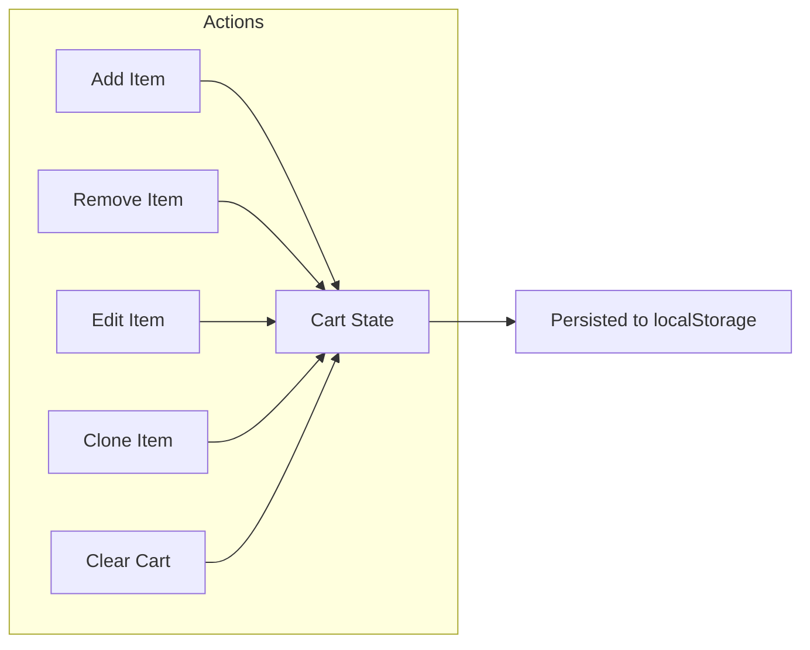
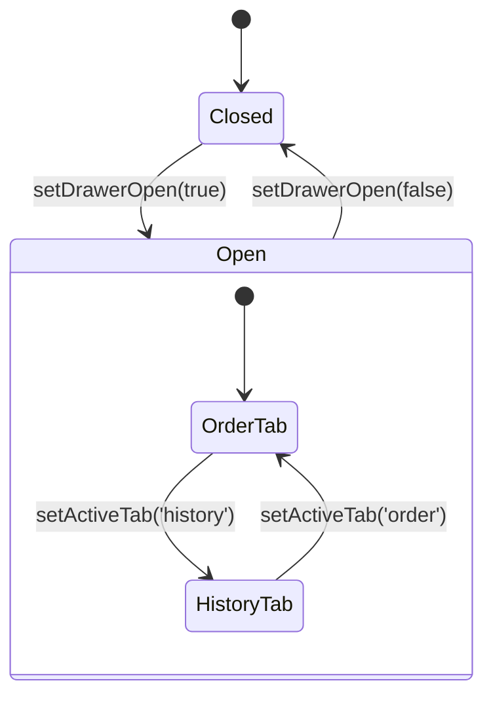
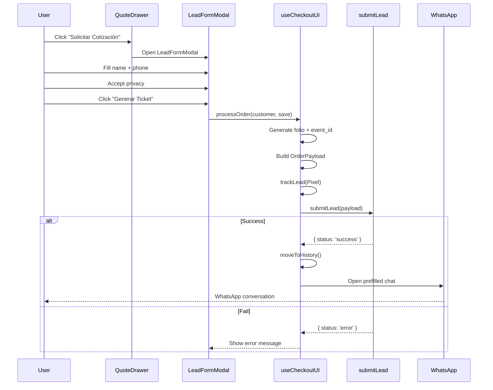
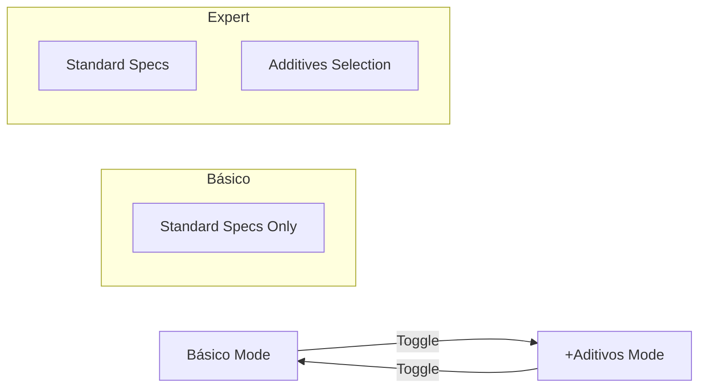
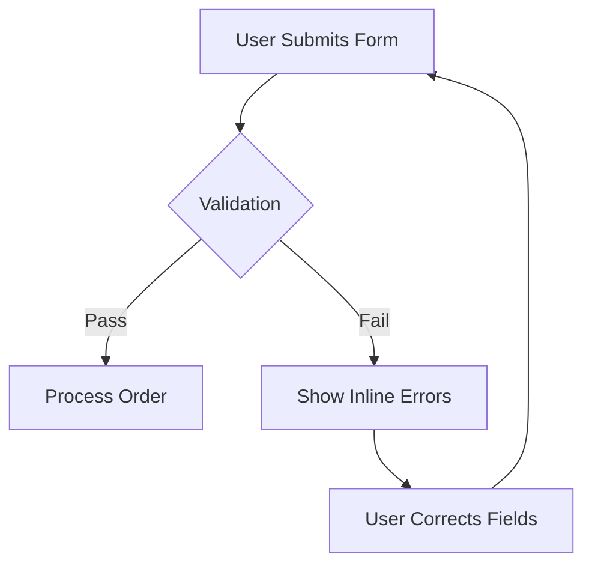
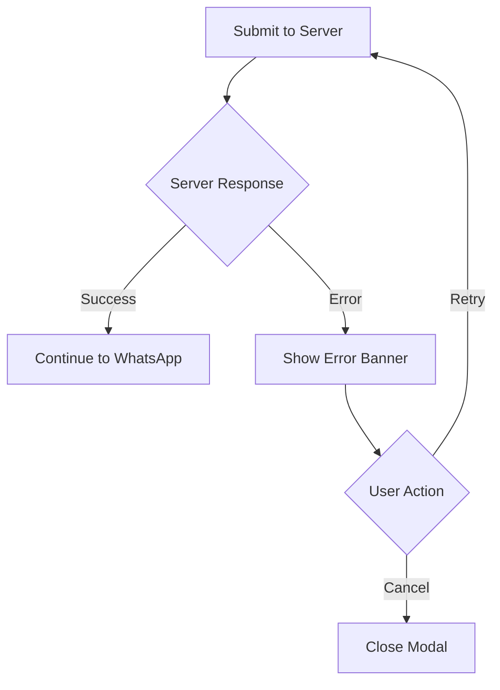
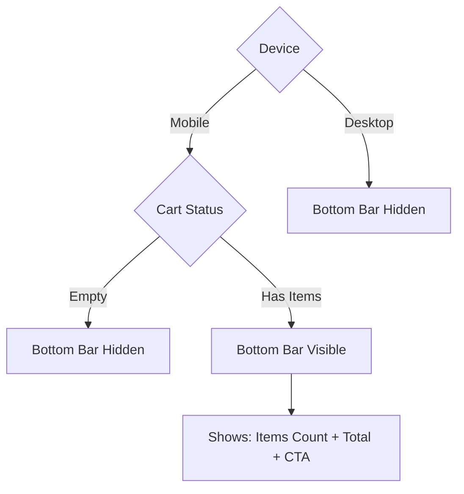

# UX Flow Maps

**Scope:** Critical user journeys and state transitions for the CEJ platform.
**Source of Truth:** Component implementations, hooks, and store logic.

---

## 1. Calculator Flow (Quote Creation)

### 1.1 High-Level Journey



### 1.2 Mode Selection

| Mode | ID | Entry Point | Next Step |
|:-----|:---|:------------|:----------|
| **Sé los m³** | `knownM3` | User knows exact volume | Direct to volume input |
| **Ayúdame a calcular** | `assistM3` | User needs dimension help | Work type selector |

### 1.3 Assist Mode Sub-Flow



### 1.4 State Machine: Calculator



---

## 2. Cart Management Flow

### 2.1 Cart Operations



### 2.2 Cart Item Lifecycle

| Action | Effect | Store Method |
|:-------|:-------|:-------------|
| **Add** | Create new CartItem from QuoteBreakdown | `addToCart(quote)` |
| **Remove** | Delete item by ID | `removeFromCart(id)` |
| **Edit** | Load item config back to draft | `editCartItem(id)` |
| **Clone** | Duplicate item with new ID | `cloneCartItem(item)` |
| **Clear** | Remove all items | `clearCart()` |
| **Checkout** | Move to history | `moveToHistory()` |

### 2.3 Quote Drawer States



---

## 3. Checkout Flow

### 3.1 End-to-End Journey



### 3.2 Lead Form Validation

| Field | Required | Validation |
|:------|:---------|:-----------|
| `name` | ✅ | Min 3 characters |
| `phone` | ✅ | Min 10 digits |
| `privacyAccepted` | ✅ | Must be checked |
| `saveMyData` | ❌ | Optional (default: true) |

### 3.3 Fail-Open Pattern

```
Normal Path:
  User → Form → Server → DB ✓ → CAPI ✓ → WhatsApp

Fail-Open Path:
  User → Form → Server → DB ✗ (logged) → WhatsApp ✓
                                ↓
                        (User never blocked)
```

---

## 4. WhatsApp Handoff

### 4.1 Message Generation

```
🧾 Cotización CEJ - Folio: [FOLIO]
━━━━━━━━━━━━━━━━

📦 [n] producto(s):

• [Label 1]
  └ [Volume] m³ · [Service] · $[Subtotal]

• [Label 2]
  └ [Volume] m³ · [Service] · $[Subtotal]

━━━━━━━━━━━━━━━━
💰 Total: $[TOTAL] MXN

👤 Cliente: [NAME]
```

### 4.2 Handoff URL

```
https://wa.me/[PHONE]?text=[ENCODED_MESSAGE]
```

---

## 5. Expert Mode Flow

### 5.1 Toggle Behavior



### 5.2 Additives Selection

| Additive | Pricing | Effect |
|:---------|:--------|:-------|
| **Fibra** | per_m³ ($150) | Volume × Price |
| **Plastimer** | per_m³ | Volume × Price |
| **Acelerante** | per_m³ | Volume × Price |

---

## 6. Error Recovery Flows

### 6.1 Validation Error Recovery



### 6.2 Server Error Recovery



---

## 7. Mobile-Specific Flows

### 7.1 Bottom Bar Visibility



### 7.2 Modal → Sheet Transformation

| Breakpoint | Dialog Style |
|:-----------|:-------------|
| < 768px | Bottom sheet (swipe up) |
| ≥ 768px | Centered modal |

---

## 8. Analytics Events

### 8.1 Tracked Events

| Event | Trigger | Destination |
|:------|:--------|:------------|
| `Lead` | Checkout submit | Pixel + CAPI |
| `Contact` (WhatsApp) | WhatsApp opens | Pixel |
| `AddToCart` | Add to cart | (Future) |
| `ViewContent` | Calculator view | (Future) |

### 8.2 Deduplication Strategy

```
Client (Pixel)  ──────────────────────────────────┐
                                                  │
                    ┌── event_id (UUID) ──────────┤
                    │                             │
Server (CAPI)  ─────┘                             ▼
                                           Meta Servers
                                           (Deduplicated)
```
