# UX Flow Maps

**Scope:** Critical user journeys and state transitions for the CEJ platform.
**Source of Truth:** Component implementations, hooks, and store logic.

---

## 1. Calculator Flow (Quote Creation)

### 1.1 High-Level Journey

```mermaid
graph LR
    A[Landing Page] --> B[Calculator Section]
    B --> C{Mode Selection}
    C -->|"Sé los m³"| D1[Direct Volume Input]
    C -->|"Ayúdame a calcular"| D2[Work Type Selection]
    D1 --> E[Specs Selection]
    D2 --> D3[Dimensions Input]
    D3 --> E
    E --> F{Expert Mode?}
    F -->|No| G[Summary/Ticket]
    F -->|Yes| H[Additives Selection]
    H --> G
    G --> I[Add to Cart]
    I --> J[Quote Drawer]
```



### 1.2 Mode Selection

| Mode | ID | Entry Point | Next Step |
|:-----|:---|:------------|:----------|
| **Sé los m³** | `knownM3` | User knows exact volume | Direct to volume input |
| **Ayúdame a calcular** | `assistM3` | User needs dimension help | Work type selector |

> **Smart Pre-fill & Persistence:**
>
> - **Strength & Service Type:** Reset to empty in `knownM3` to force conscious selection specific to the volume.
> - **Data Persistence:** Dimension inputs (Assist Mode) and Direct Volume (Known Mode) are *preserved independently*. Switching modes does not clear the other mode's data, enabling seamless toggling.

### 1.3 Assist Mode Sub-Flow


### 1.4 State Machine: Calculator


### 1.5 Deep Linking & Shared Quotes

Users can share or restore a specific quote using the `folio` URL parameter.

- **URL Format:** `/?folio=WEB-YYYYMMDD-XXXX`
- **Behavior:**
  1. System initializes and checks URL parameters.
  2. Lookups the `folio` in local History and Active Cart.
  3. **If found:** Automatically validates and displays the **Submitted Ticket** view.
  4. **If not found:** Loads default calculator state (cross-device sharing requires Phase 4 SaaS).

---

## 2. Cart Management Flow

### 2.1 Cart Operations


### 2.2 Cart Item Lifecycle

| Action | Effect | Store Method |
|:-------|:-------|:-------------|
| **Add** | Create new CartItem from QuoteBreakdown | `addToCart(quote)` |
| **Remove** | Delete item by ID | `removeFromCart(id)` |
| **Edit** | Load item config back to draft | `editCartItem(id)` |
| **Clone** | Duplicate item with new ID | `cloneCartItem(item)` |
| **Clear** | Remove all items | `clearCart()` |
| **Checkout** | Move to history | `moveToHistory()` |

### 2.3 Quote Drawer States


---

## 3. Checkout Flow

### 3.1 End-to-End Journey (Updated)

> **Note:** `moveToHistory()` is now triggered on WhatsApp click, not during initial processing.


### 3.2 Lead Form Validation

| Field | Required | Validation |
|:------|:---------|:-----------|
| `name` | ✅ | Min 3 characters |
| `phone` | ✅ | Min 10 digits |
| `privacyAccepted` | ✅ | Must be checked |
| `saveMyData` | ❌ | Optional (default: true) |

### 3.3 Fail-Open Pattern

```text
Normal Path:
  User → Form → Server → DB ✓ → CAPI ✓ → WhatsApp

Fail-Open Path:
  User → Form → Server → DB ✗ (logged) → WhatsApp ✓
                                ↓
                        (User never blocked)
```

---

## 3.4 Progressive Disclosure Flow

The quote summary uses progressive disclosure to reduce cognitive load:

```mermaid
stateDiagram-v2
    [*] --> EmptyState: No inputs
    EmptyState --> CompactView: Valid calculation
    CompactView --> FullBreakdown: Click "Ver Desglose"
    FullBreakdown --> RequestQuote: Click "Solicitar Cotización"
    RequestQuote --> SubmittedTicket: processOrder success
    SubmittedTicket --> [*]: User clicks WhatsApp or closes
```



| State | Visibility | User Action |
|:------|:-----------|:------------|
| **Empty** | "Completa los datos para ver tu cotización" | Fill calculator |
| **Compact** | Total + Volume only | "Ver Desglose" button |
| **Breakdown** | Full ticket preview (no folio) | "Solicitar Cotización" button |
| **Submitted** | Full ticket with folio + customer name | WhatsApp, PDF, Share, History, New Quote |

**Implementation:**

```tsx
// useCejStore
breakdownViewed: boolean;  // Tracks if user clicked "Ver Desglose"
setBreakdownViewed: (viewed: boolean) => void;
```

---

## 4. WhatsApp Handoff

### 4.1 Message Generation

```text
🧾 Cotización CEJ - Folio: [FOLIO]
━━━━━━━━━━━━━━━━

📦 [n] producto(s):

• [Label 1]
  └ [Volume] m³ · [Service] · $[Subtotal]

• [Label 2]
  └ [Volume] m³ · [Service] · $[Subtotal]

━━━━━━━━━━━━━━━━
💰 Total: $[TOTAL] MXN

👤 Cliente: [NAME]
```

### 4.2 Handoff URL

```text
https://wa.me/[PHONE]?text=[ENCODED_MESSAGE]
```

---

## 5. Expert Mode Flow

### 5.1 Toggle Behavior

```mermaid
flowchart LR
    A[Básico Mode] -->|Toggle| B[+Aditivos Mode]
    B -->|Toggle| A

    subgraph Básico
        A1[Standard Specs Only]
    end

    subgraph Expert
        B1[Standard Specs]
        B2[Additives Selection]
    end
```

### 5.2 Additives Selection

| Additive | Pricing | Effect |
|:---------|:--------|:-------|
| **Fibra** | per\_m³ ($150) | Volume × Price |
| **Plastimer** | per\_m³ | Volume × Price |
| **Acelerante** | per\_m³ | Volume × Price |

---

## 6. Error Recovery Flows

### 6.1 Validation Error Recovery


### 6.2 Server Error Recovery


---

## 7. Mobile-Specific Flows

### 7.1 Bottom Bar Visibility


### 7.2 Modal → Sheet Transformation

| Breakpoint | Dialog Style |
|:-----------|:-------------|
| \< 768px | Bottom sheet (swipe up) |
| ≥ 768px | Centered modal |

---

## 8. Analytics Events

### 8.1 Tracked Events

| Event | Trigger | Destination |
|:------|:--------|:------------|
| `Lead` | Checkout submit | Pixel + CAPI |
| `Contact` (WhatsApp) | WhatsApp opens | Pixel |
| `AddToCart` | Add to cart | (Future) |
| `ViewContent` | Calculator view | (Future) |

### 8.2 Deduplication Strategy

```text
Client (Pixel)  ──────────────────────────────────┐
                                                  │
                    ┌── event_id (UUID) ──────────┤
                    │                             │
Server (CAPI)  ─────┘                             ▼
                                           Meta Servers
                                           (Deduplicated)
```

---

## 9. SaaS & Authentication Flows (Phase 4A)

### 9.1 Magic Link Login


### 9.2 Re-Order Flow

Allows users to clone a historical order into the current cart with *current* pricing.


---

## 10. Quote Lifecycle States (Cotización vs Pedido)

### 10.1 State Definitions

A quote transitions through distinct states based on user actions:

| State | Name (UI) | Definition | Trigger |
|:------|:----------|:-----------|:--------|
| `draft` | *Borrador* | Active calculation, not yet submitted | User fills calculator |
| `quoted` | *Cotización* | Ticket generated with folio, awaiting action | `processOrder()` completes |
| `contacted` | *Contactado* | User initiated contact via WhatsApp/Call | Click on WhatsApp/Call CTA |
| `confirmed` | *Pedido Confirmado* | Sales confirmed the order | {PLANNED: Manual update by sales} |

### 10.2 State Machine


### 10.3 History Item States

Items in `history: CartItem[]` can be distinguished by metadata:

| Property | Draft | Quoted | Contacted |
|:---------|:------|:-------|:----------|
| `id` | ✅ | ✅ | ✅ |
| `timestamp` | ✅ | ✅ | ✅ |
| `customer` | ❌ | ✅ | ✅ |
| `folio` | ❌ | ✅ (via CartItem) | ✅ |
| `contactedAt` | ❌ | ❌ | ✅ {PLANNED} |

### 10.4 Contact SLA {SLA_CONTACTO}

When a quote is submitted, the expected response time from sales is:

| Submission Time | SLA Message | Expected Contact |
|:----------------|:------------|:-----------------|
| Before 4:00 PM | "Te contactaremos en el transcurso de la próxima hora." | Within 1 hour |
| After 4:00 PM | "Te contactaremos a primera hora del siguiente día hábil." | Next business day AM |

**Implementation Note:** Time-based SLA messages should use the server timestamp or client local time to determine which message to display.

### 10.5 Future: Contact Channels {PLANNED}

| Channel | CTA Label | Status |
|:--------|:----------|:-------|
| WhatsApp | "Continuar en WhatsApp" | ✅ Implemented |
| Phone Call | "Llamar a Ventas" | {PLANNED} |
| Email | "Enviar por Correo" | {PLANNED} |
| Schedule | "Programar Entrega" | {PLANNED} |

### 10.6 History Management Actions

| Action | Effect | Store Method |
|:-------|:-------|:-------------|
| **Reutilizar** | Load quote config into draft, open calculator | `loadQuote(item)` |
| **Ver Detalles** | Expand item to show full breakdown | {PLANNED} |
| **Descargar PDF** | Generate and download PDF | {PLANNED} |
| **Eliminar** | Remove from history | {PLANNED: Future consideration} |

---

## 11. Form Compactness Recommendations

### 11.1 Layout Optimization Principles

For the "Ayúdame a calcular" flow, apply these UX best practices:

| Principle | Implementation | Rationale |
|:----------|:---------------|:----------|
| **Group related fields** | Largo + Ancho in same row | Reduces perceived form length |
| **Visual hierarchy** | Primary inputs larger, modifiers smaller | Guides attention |
| **Progressive disclosure** | Show coffered options only when slab selected | Avoids overwhelming users |
| **Compact spacing** | Reduce `gap` from 1.5rem to 1rem between fields | More content visible above fold |

### 11.2 Recommended Field Layout

```text
┌─────────────────────────────────────┐
│ Método de cálculo                   │
│ [Largo × Ancho] [Por Área (m²)]     │
├─────────────────────────────────────┤
│ ┌─────────────┐ ┌─────────────┐     │
│ │ Largo (m)   │ │ Ancho (m)   │     │  ← Same row
│ └─────────────┘ └─────────────┘     │
├─────────────────────────────────────┤
│ ┌───────────────────────────────┐   │
│ │ Grosor (cm)                   │   │  ← Full width when visible
│ └───────────────────────────────┘   │
├─────────────────────────────────────┤
│ Tipo de Losa (if slab)              │
│ [Sólida] [Aligerada]                │  ← Collapsed by default
└─────────────────────────────────────┘
```

### 11.3 CSS Implementation

```scss
// Compact grid for dimension inputs
.compactGrid {
    display: grid;
    grid-template-columns: 1fr 1fr;
    gap: 1rem; // Reduced from 1.5rem
}

// Tighter field spacing in assist mode
.assistModeFields {
    display: flex;
    flex-direction: column;
    gap: var(--sp-3); // Compact vertical rhythm
}
```

---

## Related Documents

- [`VALIDATION.md`](./VALIDATION.md) — Validation timing and error handling
- [`COPY_GUIDELINES.md`](./COPY_GUIDELINES.md) — Message catalog
- [`UI_STATES.md`](./UI_STATES.md) — Visual state definitions
- [`INTERACTION_PATTERNS.md`](./INTERACTION_PATTERNS.md) — Form interaction patterns
