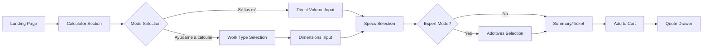
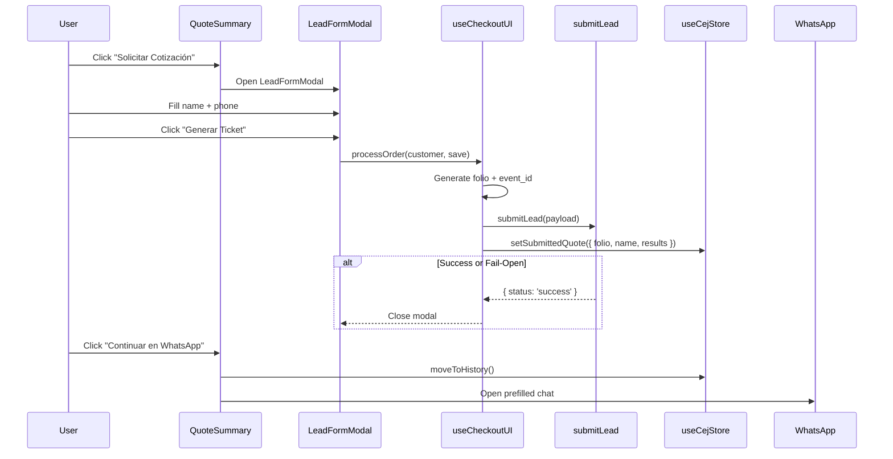

# UX & UI Standards - CEJ Platform

**Scope:** Critical user journeys, state transitions, interaction patterns, and validation rules.
**Source of Truth:** Component implementations, hooks, store logic, and SCSS modules.

---

## 1. User Flows & State Machines

### 1.1 Calculator Flow (Quote Creation)



### 1.2 Assist Mode Logic

When using "Ayúdame a calcular", the system applies specific factors based on the work type:

| Work Type | Calculation Logic | Notes |
|:----------|:------------------|:------|
| **Losa sólida** | `L * W * T * 0.98` | 2% reduction factor for waste/compression |
| **Losa aligerada** | `Area * Coefficient` | Uses Contribution Coefficient ($m^3/m^2$) |
| **Other (Zapata/Firme)** | `L * W * T` | Direct geometric calculation |

#### Coffered Slab Coefficients (Casetón)

| Casetón Size | Total Thickness | Coefficient ($m^3/m^2$) |
|:-------------|:----------------|:-------------------------|
| **7 cm** | 12 cm | **0.085** |
| **10 cm** | 15 cm | **0.108** |
| **15 cm** | 20 cm | **0.135** |

> [!TIP]
> **Custom Compression Layer:** If a user provides a manual thickness (different from the standard 5cm compression), the system recalculates the coefficient:
> `New Coefficient = (Standard Coefficient - 0.05) + (Manual Thickness / 100)`

### 1.3 Work Type Catalog

The "Ayúdame a calcular" flow recommends concrete strengths based on the selected work type:

| ID | Label | Recommended Strength ($f'c$) |
|:---|:------|:-----------------------------|
| `slab` | Losa | 200 |
| `lightInteriorFloor` | Piso interior ligero | 150 |
| `vehicleFloor` | Piso exterior / vehículos | 200 |
| `footings` | Cimientos / zapatas | 200 |
| `walls` | Muros / industrial pesado | 250 |

**Rounding:** All calculated volumes are rounded to the nearest **0.5 m³** for billing (e.g., 3.12 becomes 3.50).

### 1.4 Checkout Flow (WhatsApp Handoff)



### 1.5 Deep Linking (`folio`)

Users can restore a specific submitted quote using the `folio` URL parameter:
`/?folio=WEB-YYYYMMDD-XXXX`

- **Behavior:** If the folio is found in local history, the system automatically displays the **Submitted Ticket** view, bypassing the calculator.

---

## 2. Interaction Patterns

### 2.1 Validation Strategy (Hybrid)

| Phase | Trigger | Behavior |
|:------|:--------|:---------|
| **Initial** | Field untouched | No validation shown |
| **On Blur** | User leaves touched field | Validate and show error |
| **On Change** | User types in touched field | Clear error if now valid |
| **On Submit** | Form submission | Validate all, focus first error |

### 2.2 Progressive Disclosure

The quote summary reduces cognitive load by revealing information in stages:

1. **Compact:** Total + Volume visible (Price focus).
2. **Breakdown:** Full itemized ticket (revealed via "Ver Desglose").
3. **Submitted:** Ticket with Folio + Customer Name + WhatsApp CTA.

### 2.3 Fail-Open Pattern

Users are **never blocked** by backend failures. If the database write (`submitLead`) fails, the error is logged silently, and the user proceeds to the WhatsApp handoff.

---

## 3. UI States Catalog

### 3.1 Empty States

- **Cart Empty:** "Tu pedido está vacío. Usa el cotizador para agregar productos."
- **History Empty:** "Sin historial. Aquí aparecerán tus cotizaciones enviadas."

### 3.2 Loading Patterns

- **Button Loading:** Spinner replaces text. Interaction disabled.
- **Data Loading:** Skeleton placeholders for dashboard lists.

---

## 4. WhatsApp & SLA Standards

### 4.1 Message Structure

```text
🧾 Cotización CEJ - Folio: [FOLIO]
━━━━━━━━━━━━━━━━
📦 [n] producto(s):
• [Specs] - [Volume] m³ - $[Subtotal]
━━━━━━━━━━━━━━━━
💰 Total: $[TOTAL] MXN
👤 Cliente: [NAME]
```

### 4.2 Contact SLA

Response expectation messages based on submission time:

| Time Range | Expected Contact |
|:-----------|:-----------------|
| Mon-Fri < 4 PM | Within 1 hour |
| After 4 PM / Weekend | Next business day AM |

### 4.3 Business Master Data (`BUSINESS_INFO`)

Canonical brand and contact information used across the platform:

- **Brand Name:** Concreto y Equipos de Juárez (CEJ)
- **Address:** Av. Ejército Nacional 6225, Local 27, Ciudad Juárez, CHIH, 32528
- **Hours:**
  - Mon-Fri: 08:00 - 17:00
  - Sat: 08:00 - 13:00
- **Geo:** 31.7138, -106.4447

---

## 5. Validation Rules (Spanish)

### 5.1 Field Rules

| Field | Rule | Error Message |
|:------|:-----|:--------------|
| **Name** | Min 3 chars | "El nombre es muy corto" |
| **Phone** | 10 digits | "Verifica el número (10 dígitos)" |
| **Volume** | > 0 | "Ingresa un volumen mayor a 0 m³" |
| **Privacy** | Required | "Debes aceptar el aviso de privacidad" |

### 5.2 Formatting

- **Volume:** Always 2 decimal places (`4.00 m³`).
- **Currency:** MXN format (`$1,234.56 MXN`).

---

## Related Documents

- [`DESIGN_SYSTEM.md`](./DESIGN_SYSTEM.md) — Visual tokens and layout.
- [`COPY_GUIDELINES.md`](./COPY_GUIDELINES.md) — Full message catalog.
- [`DB_SCHEMA.md`](./DB_SCHEMA.md) — Data structures and RLS.
